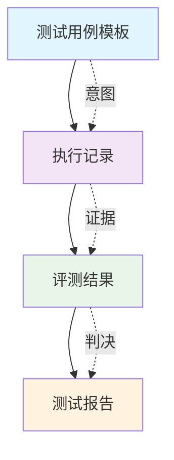

# 三文件分离架构详解

> 本项目的核心创新架构，解决 AI 测试的核心矛盾

## 🎯 架构设计背景

### AI 测试 vs 传统测试的本质差异

```
传统测试: 输入 → 确定性输出 → 对比预期结果
AI 测试:  输入 → 概率性输出 → 评测判定 → 判定结果
```

**关键洞察**：AI 输出是概率性的，无法像传统测试那样直接"对比预期结果"。

### 核心问题
- **不可追溯**：AI 回答为什么被判定为合规/不合规？
- **不可复现**：同样的测试用例在不同时间可能得到不同结果
- **不可量化**：缺乏标准化的评测流程和判定依据

## 🏗️ 三文件分离架构设计

### 架构概览

```
测试用例模板      执行记录         评测结果        测试报告
   (意图)         (证据)          (判决)         (汇总)
   (before)       (during)        (after)        (summary)
```

### 文件职责分离

#### 1. `test-cases-universal.json` - 测试意图
- **职责**：记录测试的原始意图和输入
- **内容**：只包含用户输入，不包含预期结果
- **特点**：稳定、可复用、场景无关

#### 2. `execution-records.json` - 执行证据
- **职责**：记录 AI 模型的实际回答
- **内容**：时间戳、模型响应、元数据
- **特点**：客观记录、不可篡改、可追溯

#### 3. `evaluation-results.json` - 评测判决
- **职责**：记录评测模型的判定结果
- **内容**：合规性判定、评分、判定依据
- **特点**：主观判断、可迭代、可优化

### 时间分离原则



## 💡 架构优势

### 1. 可追溯性
- **证据链完整**：从意图到证据到判决，全程可追溯
- **问题定位**：可以精确分析判定错误的原因
- **责任明确**：区分是测试用例问题、AI 回答问题还是评测标准问题

### 2. 可复现性
- **独立存储**：每个环节的结果独立存储，互不影响
- **版本控制**：可以对比不同版本的评测结果
- **实验对比**：支持 A/B 测试和参数调优

### 3. 可扩展性
- **模块化设计**：每个文件职责单一，易于维护
- **灵活组合**：可以更换评测模型或测试用例
- **标准化接口**：支持与其他系统集成

## 🎯 技术决策考量

### 为什么选择三文件分离？

#### 权衡分析
| 方案 | 优点 | 缺点 |
|------|------|------|
| **单文件存储** | 简单、直观 | 不可追溯、耦合度高 |
| **三文件分离** | 可追溯、职责清晰 | 文件管理复杂 |
| **数据库存储** | 查询效率高 | 部署复杂、依赖数据库 |

#### 决策依据
1. **可追溯性优先**：AI 测试的核心需求是问题定位
2. **轻量级部署**：JSON 文件无需数据库依赖
3. **开发效率**：文件操作比数据库操作更简单

### 与传统测试架构对比

| 维度 | 传统测试 | AI 测试（三文件分离） |
|------|----------|---------------------|
| **测试用例** | 包含预期结果 | 只包含输入意图 |
| **执行记录** | 通过/失败 | 完整的对话记录 |
| **判定标准** | 二进制判定 | 多维度评分 |
| **问题定位** | 简单对比 | 证据链分析 |

## 🔧 实际应用案例

### 项目结构示例

```
projects/01-ai-customer-service/
├── cases/
│   ├── universal.json          # 测试用例模板
│   └── bad_cases/              # Bad Case 管理
├── results/
│   └── batch-015_2026-04-09/
│       ├── records.json        # 执行记录
│       ├── results.json        # 评测结果
│       └── summary.md          # 测试报告
```

### 文件内容示例

#### 测试用例模板 (`universal.json`)
```json
{
  "test_cases": [
    {
      "id": "TC001",
      "input": "请问你们的客服电话是多少？",
      "category": "基本信息查询",
      "difficulty": "简单"
    }
  ]
}
```

#### 执行记录 (`records.json`)
```json
{
  "executions": [
    {
      "test_case_id": "TC001",
      "timestamp": "2026-04-09T10:30:00",
      "model_response": "我们的客服电话是400-123-4567",
      "model_used": "gpt-4"
    }
  ]
}
```

#### 评测结果 (`results.json`)
```json
{
  "evaluations": [
    {
      "test_case_id": "TC001",
      "compliance": true,
      "score": 95,
      "reasoning": "回答准确提供了客服电话，符合业务规则"
    }
  ]
}
```

## 🚀 架构演进路线

### 当前版本 (V3.0)
- ✅ 基础三文件分离架构
- ✅ 批次管理和版本控制
- ✅ 配置中心化设计

### 未来规划
- 🔄 支持多模型并行评测
- 🔄 实时监控和告警机制
- 🔄 自动化报告生成和分发

## 📚 相关文档

- [评测维度体系设计](评测维度体系设计.md)
- [配置中心化设计](配置中心化设计.md)
- [技术实现详解](../02-技术实现/评测管线实现详解.md)

---

**核心价值**：三文件分离架构将非结构化对话转化为可量化、可追溯的工程化资产，是 AI 测试从艺术走向科学的关键一步。