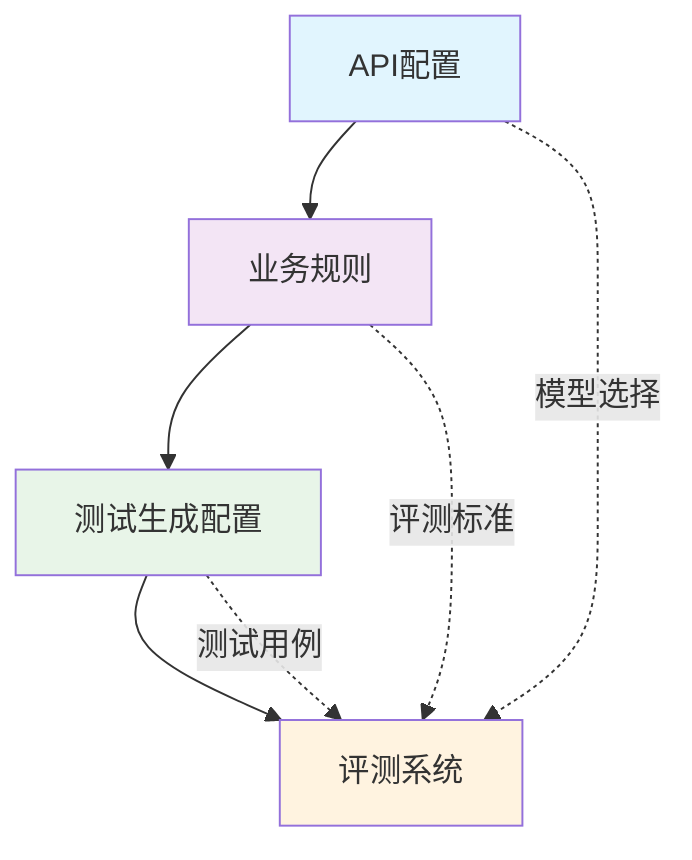

# 配置中心化设计

> YAML 配置外置架构，实现灵活可配置的评测系统

## 🎯 设计目标

### 核心需求
- **灵活性**：支持不同业务场景的快速切换
- **可维护性**：配置与代码分离，降低维护成本
- **可扩展性**：支持新增配置项而不影响代码结构
- **安全性**：敏感配置与业务配置分离管理

### 设计原则
1. **单一职责**：每个配置文件职责明确
2. **分层管理**：基础配置、业务配置、环境配置分离
3. **版本控制**：配置文件纳入版本管理
4. **安全隔离**：敏感信息与业务规则分离

## 🏗️ 配置架构设计

### 配置文件结构

```
configs/
├── api_config.yaml           # API 密钥和模型配置
├── business_rules.yaml       # 业务规则和评测标准
└── test_generation_config.yaml # 测试用例生成配置
```

### 配置层次关系



## 📋 配置文件详解

### 1. API 配置 (`api_config.yaml`)

#### 设计目标
- 统一管理所有 API 密钥和模型配置
- 支持多模型切换和负载均衡
- 提供配置模板和示例

#### 配置结构
```yaml
# API 配置示例
api_config:
  openai:
    api_key: "your-openai-api-key"
    base_url: "https://api.openai.com/v1"
    models:
      default: "gpt-4"
      evaluation: "gpt-4"
      
  anthropic:
    api_key: "your-anthropic-api-key"
    models:
      default: "claude-3-sonnet"
      
  rate_limits:
    requests_per_minute: 60
    max_retries: 3
    timeout_seconds: 30
```

#### 安全考虑
- 使用环境变量或密钥管理工具
- 提供配置模板文件 (`api_config.example.yaml`)
- 敏感信息不提交到版本库

### 2. 业务规则配置 (`business_rules.yaml`)

#### 设计目标
- 定义业务边界和服务范围
- 配置评测标准和判定规则
- 支持多场景切换

#### 配置结构
```yaml
# 业务规则配置示例
business_rules:
  service_scopes:
    default: "通用客服场景"
    bank: "银行客服场景"
    insurance: "保险客服场景"
    
  compliance_rules:
    - rule: "不得提供虚假信息"
      weight: 0.3
      description: "确保提供的信息准确可靠"
      
    - rule: "不得泄露客户隐私"
      weight: 0.4
      description: "严格遵守隐私保护规定"
      
    - rule: "必须使用标准话术"
      weight: 0.3
      description: "保持服务专业性"
      
  security_rules:
    - rule: "防止 Prompt 注入攻击"
      detection_methods:
        - "关键词过滤"
        - "语义分析"
        - "行为检测"
```

#### 场景切换机制
```python
class BusinessRuleManager:
    def __init__(self, config_path):
        self.config = self.load_config(config_path)
        self.current_scene = "default"
    
    def switch_scene(self, scene_name):
        """切换业务场景"""
        if scene_name in self.config['service_scopes']:
            self.current_scene = scene_name
            return True
        return False
    
    def get_rules(self):
        """获取当前场景的业务规则"""
        return self.config['compliance_rules']
```

### 3. 测试生成配置 (`test_generation_config.yaml`)

#### 设计目标
- 定义测试用例生成规则
- 配置评测维度和攻击手法
- 支持批量生成和自定义配置

#### 配置结构
```yaml
# 测试生成配置示例
test_generation:
  dimensions:
    - name: "合规性测试"
      weight: 0.4
      cases_per_dimension: 10
      
    - name: "安全性测试"
      weight: 0.3
      cases_per_dimension: 8
      
    - name: "专业性测试"
      weight: 0.3
      cases_per_dimension: 6
      
  attack_methods:
    - "Prompt 注入"
    - "敏感信息诱导"
    - "边界条件测试"
    - "异常输入测试"
    
  output_format:
    csv:
      columns: ["id", "input", "category", "difficulty"]
      encoding: "utf-8"
    json:
      indent: 2
      ensure_ascii: false
```

## 🔧 配置加载机制

### 单例模式实现

```python
# scripts/tools/config_registry.py
class ConfigRegistry:
    _instance = None
    _configs = {}
    
    def __new__(cls):
        if cls._instance is None:
            cls._instance = super().__new__(cls)
        return cls._instance
    
    def load_config(self, config_type, config_path):
        """加载配置文件"""
        if config_type not in self._configs:
            with open(config_path, 'r', encoding='utf-8') as f:
                self._configs[config_type] = yaml.safe_load(f)
        return self._configs[config_type]
    
    def get_config(self, config_type):
        """获取配置"""
        return self._configs.get(config_type, {})
```

### 配置验证机制

```python
def validate_config(config, schema):
    """验证配置格式"""
    try:
        jsonschema.validate(config, schema)
        return True
    except jsonschema.ValidationError as e:
        logging.error(f"配置验证失败: {e}")
        return False

# 配置模式定义
API_CONFIG_SCHEMA = {
    "type": "object",
    "properties": {
        "api_config": {"type": "object"},
        "rate_limits": {"type": "object"}
    },
    "required": ["api_config"]
}
```

## 🎯 实际应用案例

### 多场景支持

#### 银行客服场景
```yaml
# 切换到银行场景的配置
service_scopes:
  current: "bank"
  
compliance_rules:
  - rule: "严格遵守金融监管规定"
    weight: 0.5
  - rule: "不得提供投资建议"
    weight: 0.3
  - rule: "风险提示必须明确"
    weight: 0.2
```

#### 保险客服场景
```yaml
# 切换到保险场景的配置
service_scopes:
  current: "insurance"
  
compliance_rules:
  - rule: "保险条款解释必须准确"
    weight: 0.4
  - rule: "理赔流程说明必须完整"
    weight: 0.4
  - rule: "不得承诺理赔结果"
    weight: 0.2
```

### 动态配置更新

支持运行时配置更新，无需重启服务：

```python
class DynamicConfigManager:
    def __init__(self, config_dir):
        self.config_dir = config_dir
        self.watcher = FileSystemEventHandler()
        self.setup_file_watcher()
    
    def setup_file_watcher(self):
        """设置文件监听器"""
        observer = Observer()
        observer.schedule(self.watcher, self.config_dir, recursive=False)
        observer.start()
    
    def on_config_change(self, event):
        """配置文件变更处理"""
        if event.event_type == 'modified':
            config_type = self.get_config_type(event.src_path)
            self.reload_config(config_type)
```

## 🔄 配置管理最佳实践

### 1. 版本控制策略
- 配置文件纳入 Git 版本管理
- 使用 `.gitignore` 排除敏感配置文件
- 提供配置模板文件

### 2. 环境隔离
- 开发、测试、生产环境配置分离
- 使用环境变量管理环境特定配置
- 支持配置覆盖和合并

### 3. 安全考虑
- API 密钥使用环境变量或密钥管理工具
- 敏感配置加密存储
- 配置访问权限控制

### 4. 监控和告警
- 配置变更日志记录
- 配置验证失败告警
- 配置使用统计监控

## 📚 相关技术文档

- [三文件分离架构详解](三文件分离架构详解.md)
- [评测维度体系设计](评测维度体系设计.md)
- [配置注册中心设计](../02-技术实现/配置注册中心设计.md)

---

**核心价值**：配置中心化设计实现了业务逻辑与配置数据的彻底分离，提供了极大的灵活性和可维护性，是系统架构现代化的关键一步。