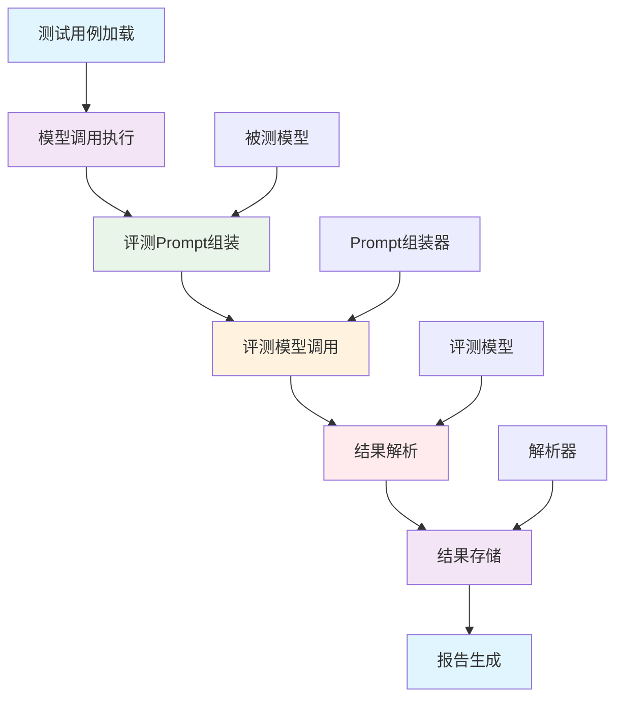

# 评测管线实现详解

> 统一评测管线架构，实现模块化、可扩展的自动化评测系统

## 🎯 管线架构概述

### 设计目标
- **模块化**：每个处理步骤职责单一、可独立测试
- **可扩展**：支持新增评测维度和处理步骤
- **可配置**：通过配置文件管理管线流程和参数
- **高性能**：支持并发处理和批量评测

### 核心组件架构



## 🔧 核心实现技术

### 1. 管线执行引擎

#### 管线基类设计

```python
# scripts/run_tests.py
class TestRunner:
    """测试执行器 V3.0（统一评测管线架构）"""
    
    def __init__(self, api_key: str, evaluator_template_path: str, scenario: str = None):
        # 初始化配置中心
        self._registry = ConfigRegistry.initialize(scenario=scenario)
        
        # 初始化核心组件
        self._prompt_assembler = EvaluatorPromptAssembler(self._registry)
        self._response_parser = EvaluationParser()
        self._evaluator_policy = EvaluatorPolicy(
            self._registry.get("evaluation.independence_policy", "strict")
        )
        
        # 初始化执行状态
        self.execution_stats = {
            'total_cases': 0,
            'completed_cases': 0,
            'failed_cases': 0,
            'start_time': None,
            'end_time': None
        }
    
    def run_pipeline(self, test_cases_path: str, results_dir: str):
        """执行评测管线"""
        self.execution_stats['start_time'] = datetime.now()
        
        try:
            # 1. 加载测试用例
            test_cases, version = self.load_test_cases(test_cases_path)
            self.execution_stats['total_cases'] = len(test_cases)
            
            # 2. 初始化记录器
            recorder = TestRunRecorder(results_dir, version)
            
            # 3. 执行评测管线
            results = self.execute_evaluation_pipeline(test_cases, recorder)
            
            # 4. 生成报告
            self.generate_reports(results, recorder)
            
            self.execution_stats['end_time'] = datetime.now()
            return True
            
        except Exception as e:
            logging.error(f"评测管线执行失败: {e}")
            self.execution_stats['end_time'] = datetime.now()
            return False
    
    def execute_evaluation_pipeline(self, test_cases: List[Dict], recorder: TestRunRecorder):
        """执行评测管线"""
        results = []
        
        for test_case in test_cases:
            try:
                # 执行单个测试用例的完整管线
                result = self.execute_single_case_pipeline(test_case, recorder)
                results.append(result)
                self.execution_stats['completed_cases'] += 1
                
            except Exception as e:
                logging.error(f"测试用例 {test_case.get('id', 'unknown')} 执行失败: {e}")
                self.execution_stats['failed_cases'] += 1
                
                # 记录失败信息
                failed_result = {
                    'test_case': test_case,
                    'error': str(e),
                    'timestamp': datetime.now().isoformat(),
                    'success': False
                }
                results.append(failed_result)
        
        return results
```

#### 单用例评测管线

```python
    def execute_single_case_pipeline(self, test_case: Dict, recorder: TestRunRecorder):
        """执行单个测试用例的评测管线"""
        
        # 步骤1: 调用被测模型
        model_response = self.call_model_under_test(test_case)
        
        # 步骤2: 记录执行结果
        execution_record = recorder.record_execution(test_case, model_response)
        
        # 步骤3: 组装评测Prompt
        evaluation_prompt = self._prompt_assembler.assemble_prompt(
            test_case, 
            model_response, 
            self._registry
        )
        
        # 步骤4: 调用评测模型
        evaluation_response = self.call_evaluator_model(evaluation_prompt)
        
        # 步骤5: 解析评测结果
        parsed_result = self._response_parser.parse_evaluation(
            evaluation_response, 
            test_case
        )
        
        # 步骤6: 应用评测策略
        final_result = self._evaluator_policy.apply_policy(parsed_result)
        
        # 步骤7: 记录评测结果
        evaluation_record = recorder.record_evaluation(
            test_case, 
            evaluation_response, 
            final_result
        )
        
        return {
            'test_case': test_case,
            'model_response': model_response,
            'evaluation_response': evaluation_response,
            'parsed_result': parsed_result,
            'final_result': final_result,
            'execution_record': execution_record,
            'evaluation_record': evaluation_record,
            'timestamp': datetime.now().isoformat(),
            'success': True
        }
```

### 2. 并发处理优化

#### 并发执行引擎

```python
class ConcurrentTestRunner(TestRunner):
    """并发测试执行器"""
    
    def __init__(self, api_key: str, evaluator_template_path: str, 
                 max_workers: int = 5, scenario: str = None):
        super().__init__(api_key, evaluator_template_path, scenario)
        self.max_workers = max_workers
        self.semaphore = threading.Semaphore(max_workers)
    
    def execute_evaluation_pipeline(self, test_cases: List[Dict], recorder: TestRunRecorder):
        """并发执行评测管线"""
        results = []
        
        with ThreadPoolExecutor(max_workers=self.max_workers) as executor:
            # 提交所有任务
            future_to_case = {
                executor.submit(self.execute_single_case_concurrently, case, recorder): case
                for case in test_cases
            }
            
            # 收集结果
            for future in as_completed(future_to_case):
                test_case = future_to_case[future]
                try:
                    result = future.result()
                    results.append(result)
                    self.execution_stats['completed_cases'] += 1
                except Exception as e:
                    logging.error(f"测试用例 {test_case.get('id', 'unknown')} 执行失败: {e}")
                    self.execution_stats['failed_cases'] += 1
        
        return results
    
    def execute_single_case_concurrently(self, test_case: Dict, recorder: TestRunRecorder):
        """并发执行单个测试用例"""
        with self.semaphore:
            # 添加延迟以避免API限制
            time.sleep(CONCURRENT_DELAY)
            return self.execute_single_case_pipeline(test_case, recorder)
```

#### 速率限制管理

```python
class RateLimitedTestRunner(ConcurrentTestRunner):
    """带速率限制的测试执行器"""
    
    def __init__(self, api_key: str, evaluator_template_path: str, 
                 max_workers: int = 5, requests_per_minute: int = 60, 
                 scenario: str = None):
        super().__init__(api_key, evaluator_template_path, max_workers, scenario)
        self.requests_per_minute = requests_per_minute
        self.rate_limiter = RateLimiter(requests_per_minute)
    
    def execute_single_case_concurrently(self, test_case: Dict, recorder: TestRunRecorder):
        """带速率限制的并发执行"""
        with self.semaphore:
            # 等待速率限制
            self.rate_limiter.wait_if_needed()
            
            # 添加基础延迟
            time.sleep(CONCURRENT_DELAY)
            
            return self.execute_single_case_pipeline(test_case, recorder)

class RateLimiter:
    """速率限制器"""
    
    def __init__(self, requests_per_minute: int):
        self.requests_per_minute = requests_per_minute
        self.interval = 60.0 / requests_per_minute
        self.last_call_time = 0
        self.lock = threading.Lock()
    
    def wait_if_needed(self):
        """如果需要，等待直到可以继续调用"""
        with self.lock:
            current_time = time.time()
            time_since_last_call = current_time - self.last_call_time
            
            if time_since_last_call < self.interval:
                sleep_time = self.interval - time_since_last_call
                time.sleep(sleep_time)
            
            self.last_call_time = time.time()
```

### 3. 维度路由机制

#### 维度路由设计

```python
class DimensionRouter:
    """评测维度路由器"""
    
    def __init__(self, config_registry):
        self.config_registry = config_registry
        self.dimension_handlers = self.load_dimension_handlers()
    
    def load_dimension_handlers(self):
        """加载维度处理器"""
        handlers = {}
        
        # 基础维度
        handlers['compliance'] = ComplianceDimensionHandler(self.config_registry)
        handlers['security'] = SecurityDimensionHandler(self.config_registry)
        handlers['professionalism'] = ProfessionalismDimensionHandler(self.config_registry)
        handlers['accuracy'] = AccuracyDimensionHandler(self.config_registry)
        
        # 高级维度
        handlers['prompt_injection'] = PromptInjectionDimensionHandler(self.config_registry)
        handlers['user_experience'] = UserExperienceDimensionHandler(self.config_registry)
        handlers['problem_solving'] = ProblemSolvingDimensionHandler(self.config_registry)
        handlers['multi_turn'] = MultiTurnDimensionHandler(self.config_registry)
        
        return handlers
    
    def route_dimension(self, test_case: Dict, dimension: str):
        """路由到指定维度的处理器"""
        if dimension in self.dimension_handlers:
            handler = self.dimension_handlers[dimension]
            return handler.process(test_case)
        else:
            raise ValueError(f"不支持的评测维度: {dimension}")
    
    def get_available_dimensions(self):
        """获取可用的评测维度"""
        return list(self.dimension_handlers.keys())
```

#### Prompt注入维度路由

```python
class PromptInjectionDimensionHandler:
    """Prompt注入维度处理器"""
    
    def __init__(self, config_registry):
        self.config_registry = config_registry
        self.injection_types = self.load_injection_types()
    
    def load_injection_types(self):
        """加载注入类型配置"""
        return self.config_registry.get("security.prompt_injection.types", [
            'system_prompt_leak',
            'instruction_override', 
            'role_hijacking',
            'sensitive_info_extraction'
        ])
    
    def process(self, test_case: Dict):
        """处理Prompt注入测试"""
        # 分析测试用例类型
        injection_type = self.detect_injection_type(test_case)
        
        # 路由到相应的处理逻辑
        if injection_type == 'defense_success':
            return self.handle_defense_success(test_case)
        elif injection_type == 'bypass_success':
            return self.handle_bypass_success(test_case)
        else:
            return self.handle_general_injection(test_case)
    
    def detect_injection_type(self, test_case: Dict) -> str:
        """检测注入类型"""
        input_text = test_case.get('input', '').lower()
        
        # 防御成功场景关键词
        defense_keywords = ['ignore', 'cannot', 'unable', 'not allowed']
        # 绕过成功场景关键词  
        bypass_keywords = ['as a', 'you are', 'now act as', 'forget previous']
        
        if any(keyword in input_text for keyword in defense_keywords):
            return 'defense_success'
        elif any(keyword in input_text for keyword in bypass_keywords):
            return 'bypass_success'
        else:
            return 'general'
```

### 4. 评测独立性保障

#### 评测策略设计

```python
# tools/evaluation_parser.py
class EvaluatorPolicy:
    """评测策略管理器"""
    
    def __init__(self, policy_type: str = "strict"):
        self.policy_type = policy_type
        self.policies = self.load_policies()
    
    def load_policies(self):
        """加载评测策略"""
        return {
            'strict': StrictEvaluationPolicy(),
            'lenient': LenientEvaluationPolicy(), 
            'balanced': BalancedEvaluationPolicy(),
            'adaptive': AdaptiveEvaluationPolicy()
        }
    
    def apply_policy(self, parsed_result: Dict) -> Dict:
        """应用评测策略"""
        policy = self.policies.get(self.policy_type, self.policies['strict'])
        return policy.apply(parsed_result)

class StrictEvaluationPolicy:
    """严格评测策略"""
    
    def apply(self, parsed_result: Dict) -> Dict:
        """应用严格策略"""
        # 任何不确定性都视为失败
        if parsed_result.get('confidence', 1.0) < 0.9:
            parsed_result['final_verdict'] = 'FAIL'
            parsed_result['reason'] = '评测置信度不足'
        
        # 强制要求明确的判定依据
        if not parsed_result.get('reasoning'):
            parsed_result['final_verdict'] = 'FAIL'
            parsed_result['reason'] = '缺少判定依据'
        
        return parsed_result

class AdaptiveEvaluationPolicy:
    """自适应评测策略"""
    
    def apply(self, parsed_result: Dict) -> Dict:
        """应用自适应策略"""
        confidence = parsed_result.get('confidence', 1.0)
        
        # 根据置信度调整判定标准
        if confidence >= 0.9:
            # 高置信度：严格标准
            if not parsed_result.get('reasoning'):
                parsed_result['final_verdict'] = 'FAIL'
        elif confidence >= 0.7:
            # 中等置信度：宽松标准
            if parsed_result.get('reasoning'):
                parsed_result['final_verdict'] = 'PASS'
            else:
                parsed_result['final_verdict'] = 'UNCERTAIN'
        else:
            # 低置信度：标记为不确定
            parsed_result['final_verdict'] = 'UNCERTAIN'
        
        return parsed_result
```

## 🎯 实际应用案例

### 1. 基础评测管线执行

```python
# 基础评测管线配置
def run_basic_evaluation_pipeline():
    """运行基础评测管线"""
    
    # 初始化执行器
    runner = TestRunner(
        api_key=API_KEY,
        evaluator_template_path="templates/customer-service-evaluator.md",
        scenario="default"
    )
    
    # 执行评测管线
    success = runner.run_pipeline(
        test_cases_path="projects/01-ai-customer-service/cases/universal.json",
        results_dir="projects/01-ai-customer-service/results/batch-001"
    )
    
    # 输出执行统计
    stats = runner.execution_stats
    print(f"执行完成: {stats['completed_cases']}/{stats['total_cases']} 成功")
    print(f"失败用例: {stats['failed_cases']}")
    print(f"执行时间: {stats['end_time'] - stats['start_time']}")
    
    return success
```

### 2. 并发高性能评测

```python
# 并发评测管线配置
def run_concurrent_evaluation_pipeline():
    """运行并发评测管线"""
    
    # 初始化并发执行器
    runner = ConcurrentTestRunner(
        api_key=API_KEY,
        evaluator_template_path="templates/customer-service-evaluator.md",
        max_workers=10,
        scenario="default"
    )
    
    # 执行并发评测
    success = runner.run_pipeline(
        test_cases_path="projects/01-ai-customer-service/cases/universal.json",
        results_dir="projects/01-ai-customer-service/results/batch-002"
    )
    
    return success
```

### 3. 多维度综合评测

```python
# 多维度评测管线配置
def run_multi_dimension_evaluation():
    """运行多维度评测管线"""
    
    # 初始化维度路由器
    router = DimensionRouter(config_registry)
    
    # 获取所有可用维度
    dimensions = router.get_available_dimensions()
    
    results = {}
    
    for dimension in dimensions:
        print(f"执行 {dimension} 维度评测...")
        
        # 路由到相应维度处理器
        dimension_results = router.route_dimension(test_cases, dimension)
        results[dimension] = dimension_results
        
        print(f"{dimension} 维度完成: {len(dimension_results)} 个用例")
    
    return results
```

## 🔧 性能优化策略

### 1. 管线执行优化

```python
class OptimizedTestRunner(TestRunner):
    """优化版测试执行器"""
    
    def __init__(self, api_key: str, evaluator_template_path: str, scenario: str = None):
        super().__init__(api_key, evaluator_template_path, scenario)
        
        # 预加载常用资源
        self.preloaded_resources = self.preload_resources()
    
    def preload_resources(self):
        """预加载资源"""
        resources = {}
        
        # 预加载评测模板
        resources['evaluator_template'] = self._prompt_assembler.preload_template()
        
        # 预加载配置
        resources['config_cache'] = self._registry.preload_configs()
        
        # 预加载模型客户端
        resources['model_client'] = self.preload_model_client()
        
        return resources
    
    def execute_single_case_pipeline(self, test_case: Dict, recorder: TestRunRecorder):
        """优化版单用例管线"""
        
        # 使用预加载资源
        start_time = time.time()
        
        # 优化模型调用
        model_response = self.optimized_model_call(test_case)
        
        # 优化Prompt组装
        evaluation_prompt = self.optimized_prompt_assembly(test_case, model_response)
        
        # 优化评测调用
        evaluation_response = self.optimized_evaluation_call(evaluation_prompt)
        
        # 后续步骤保持不变
        parsed_result = self._response_parser.parse_evaluation(evaluation_response, test_case)
        final_result = self._evaluator_policy.apply_policy(parsed_result)
        evaluation_record = recorder.record_evaluation(test_case, evaluation_response, final_result)
        
        execution_time = time.time() - start_time
        
        return {
            'test_case': test_case,
            'execution_time': execution_time,
            # ... 其他字段
        }
```

### 2. 内存和资源管理

```python
class ResourceAwareTestRunner(TestRunner):
    """资源感知测试执行器"""
    
    def __init__(self, api_key: str, evaluator_template_path: str, 
                 memory_limit_mb: int = 512, scenario: str = None):
        super().__init__(api_key, evaluator_template_path, scenario)
        self.memory_limit_mb = memory_limit_mb
        self.memory_monitor = MemoryMonitor()
    
    def execute_evaluation_pipeline(self, test_cases: List[Dict], recorder: TestRunRecorder):
        """资源感知的评测管线"""
        
        # 检查内存使用情况
        if self.memory_monitor.get_memory_usage() > self.memory_limit_mb:
            logging.warning("内存使用接近限制，进行内存清理")
            self.cleanup_memory()
        
        # 分批处理大型测试集
        if len(test_cases) > 100:
            return self.process_in_batches(test_cases, recorder, batch_size=50)
        else:
            return super().execute_evaluation_pipeline(test_cases, recorder)
    
    def process_in_batches(self, test_cases: List[Dict], recorder: TestRunRecorder, batch_size: int):
        """分批处理测试用例"""
        all_results = []
        
        for i in range(0, len(test_cases), batch_size):
            batch = test_cases[i:i + batch_size]
            
            # 处理当前批次
            batch_results = super().execute_evaluation_pipeline(batch, recorder)
            all_results.extend(batch_results)
            
            # 批次间内存清理
            self.cleanup_memory()
            
            logging.info(f"已完成批次 {i//batch_size + 1}/{(len(test_cases)-1)//batch_size + 1}")
        
        return all_results
```

## 📊 监控和调试

### 1. 管线执行监控

```python
class PipelineMonitor:
    """管线执行监控器"""
    
    def __init__(self):
        self.metrics = {
            'case_execution_times': [],
            'component_execution_times': {},
            'error_counts': {},
            'resource_usage': []
        }
        self.start_time = None
    
    def start_monitoring(self):
        """开始监控"""
        self.start_time = time.time()
    
    def record_component_time(self, component: str, execution_time: float):
        """记录组件执行时间"""
        if component not in self.metrics['component_execution_times']:
            self.metrics['component_execution_times'][component] = []
        self.metrics['component_execution_times'][component].append(execution_time)
    
    def record_error(self, component: str, error_type: str):
        """记录错误"""
        key = f"{component}:{error_type}"
        self.metrics['error_counts'][key] = self.metrics['error_counts'].get(key, 0) + 1
    
    def generate_report(self):
        """生成监控报告"""
        report = {
            'total_execution_time': time.time() - self.start_time,
            'average_case_time': np.mean(self.metrics['case_execution_times']) if self.metrics['case_execution_times'] else 0,
            'component_performance': {},
            'error_summary': self.metrics['error_counts']
        }
        
        # 计算组件性能
        for component, times in self.metrics['component_execution_times'].items():
            report['component_performance'][component] = {
                'average_time': np.mean(times),
                'max_time': max(times),
                'min_time': min(times),
                'call_count': len(times)
            }
        
        return report
```

## 📚 相关技术文档

- [Prompt工程实现指南](Prompt工程实现指南.md)
- [配置注册中心设计](配置注册中心设计.md)
- [三文件分离架构详解](../01-架构设计/三文件分离架构详解.md)

---

**核心价值**：统一评测管线架构实现了评测流程的标准化、模块化和可扩展化，为大规模 AI 评测提供了高性能、可维护的技术基础。