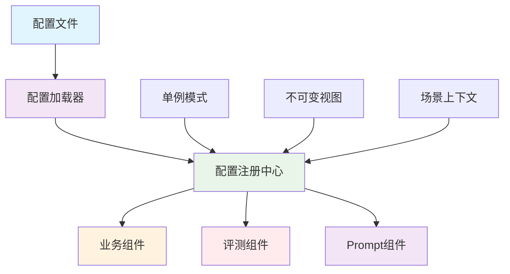

# 配置注册中心设计

> 单例模式配置管理，实现全局统一、不可变的配置访问机制

## 🎯 设计目标

### 核心需求
- **全局唯一**：整个系统只有一个配置入口
- **不可变性**：配置初始化后只读，避免运行时修改
- **显式初始化**：消除隐式全局可变状态
- **场景感知**：支持多业务场景配置切换
- **线程安全**：支持并发访问

### 设计原则
1. **单一职责**：配置管理职责明确分离
2. **不可变性**：配置数据初始化后不可修改
3. **显式控制**：所有配置访问必须通过注册中心
4. **场景隔离**：不同业务场景配置相互独立

## 🏗️ 架构设计

### 核心组件关系



### 配置层次结构

```
配置注册中心 (ConfigRegistry)
    ├── 业务规则配置 (Business Rules)
    │   ├── 默认场景 (default)
    │   ├── 银行场景 (bank) 
    │   └── 保险场景 (insurance)
    ├── 测试生成配置 (Test Generation)
    └── 场景上下文 (Evaluation Context)
```

## 🔧 核心实现技术

### 1. 单例模式实现

#### 基础单例实现

```python
# scripts/tools/config_registry.py
class ConfigRegistry:
    """配置注册中心 - 全局唯一、不可变、显式初始化"""
    
    _instance: Optional["ConfigRegistry"] = None
    _initialized: bool = False
    
    def __init__(self, config_loader: ConfigLoader, scenario: str = None):
        # 防止重复初始化
        if ConfigRegistry._initialized:
            raise RuntimeError("ConfigRegistry 已初始化，请使用 get_instance() 方法")
        
        self._loader = config_loader
        self._business_rules = config_loader.load_business_rules()
        self._test_config = config_loader.load_test_generation_config()
        
        # 场景配置
        active_scenario = scenario or self._business_rules.get("active_scenario", "default")
        self._active_scenario_key = active_scenario
        self._active_scenario = self._business_rules.get("scenarios", {}).get(active_scenario, {})
        
        # 标记为冻结状态
        self._frozen = True
        ConfigRegistry._initialized = True
    
    @classmethod
    def initialize(cls, config_dir: str = None, scenario: str = None) -> "ConfigRegistry":
        """显式初始化配置注册中心（程序入口调用）"""
        if cls._instance is not None:
            raise RuntimeError("ConfigRegistry 已初始化，请勿重复初始化")
        
        loader = ConfigLoader(config_dir=config_dir)
        instance = cls(loader, scenario=scenario)
        cls._instance = instance
        
        logger.info(f"ConfigRegistry 已初始化, scenario={instance._active_scenario_key}")
        return instance
    
    @classmethod
    def get_instance(cls) -> "ConfigRegistry":
        """获取已初始化的实例，未初始化则自动初始化"""
        if cls._instance is None or not cls._initialized:
            logger.warning("ConfigRegistry 未显式初始化，使用默认配置自动初始化")
            return cls.initialize()
        return cls._instance
    
    @classmethod
    def reset(cls):
        """重置（仅用于测试）"""
        cls._instance = None
        cls._initialized = False
```

#### 线程安全单例

```python
import threading

class ThreadSafeConfigRegistry(ConfigRegistry):
    """线程安全的配置注册中心"""
    
    _lock = threading.Lock()
    
    @classmethod
    def initialize(cls, config_dir: str = None, scenario: str = None) -> "ThreadSafeConfigRegistry":
        """线程安全的初始化方法"""
        with cls._lock:
            if cls._instance is not None:
                return cls._instance
            
            loader = ConfigLoader(config_dir=config_dir)
            instance = cls(loader, scenario=scenario)
            cls._instance = instance
            
            return instance
    
    @classmethod
    def get_instance(cls) -> "ThreadSafeConfigRegistry":
        """线程安全的实例获取"""
        with cls._lock:
            if cls._instance is None:
                return cls.initialize()
            return cls._instance
```

### 2. 不可变配置视图

#### 只读属性设计

```python
class ImmutableConfigRegistry(ConfigRegistry):
    """不可变配置注册中心"""
    
    def __setattr__(self, name, value):
        """防止属性修改"""
        if hasattr(self, '_frozen') and self._frozen:
            raise AttributeError(f"ConfigRegistry 属性 '{name}' 不可修改")
        super().__setattr__(name, value)
    
    def __getattribute__(self, name):
        """属性访问控制"""
        # 防止访问内部属性
        if name.startswith('_'):
            raise AttributeError(f"无法访问内部属性 '{name}'")
        return super().__getattribute__(name)
    
    @property
    def business_scenario_name(self) -> str:
        """业务场景名称（只读）"""
        return self._active_scenario.get("name", "通用客服")
    
    @property
    def business_scenario_description(self) -> str:
        """业务场景描述（只读）"""
        return self._active_scenario.get("description", "")
    
    @property
    def active_scenario_key(self) -> str:
        """当前场景键（只读）"""
        return self._active_scenario_key
    
    @property
    def service_boundaries(self) -> dict:
        """服务边界配置（只读）"""
        return self._active_scenario.get("service_boundaries", {"in_scope": [], "out_of_scope": []})
    
    @property
    def constraints(self) -> list:
        """约束规则（只读）"""
        return self._active_scenario.get("constraints", [])
    
    @property
    def business_language_norms(self) -> dict:
        """业务语言规范（只读）"""
        return self._active_scenario.get("business_language_norms", {})
```

#### 配置访问方法

```python
    def get(self, key: str, default: Any = None) -> Any:
        """安全获取配置值"""
        try:
            # 支持点分隔的路径访问
            keys = key.split('.')
            value = self._config_data
            
            for k in keys:
                if isinstance(value, dict) and k in value:
                    value = value[k]
                else:
                    return default
            
            return value
        except (AttributeError, KeyError, TypeError):
            return default
    
    def get_scenario_config(self, scenario_key: str = None) -> dict:
        """获取指定场景的配置"""
        scenario_key = scenario_key or self._active_scenario_key
        scenarios = self._business_rules.get("scenarios", {})
        return scenarios.get(scenario_key, {})
    
    def list_available_scenarios(self) -> List[str]:
        """列出所有可用场景"""
        scenarios = self._business_rules.get("scenarios", {})
        return list(scenarios.keys())
```

### 3. 场景上下文管理

#### 场景上下文设计

```python
class EvaluationContext:
    """评测上下文 - 场景持久化，解决跨脚本参数传递断裂"""
    
    def __init__(self, registry: ConfigRegistry):
        self.registry = registry
        self.scenario_fingerprint = self._generate_scenario_fingerprint()
        self.context_data = {}
    
    def _generate_scenario_fingerprint(self) -> str:
        """生成场景指纹，确保用例生成与评测使用相同场景"""
        scenario_data = {
            'scenario_key': self.registry.active_scenario_key,
            'service_boundaries': self.registry.service_boundaries,
            'constraints': self.registry.constraints
        }
        
        # 使用哈希确保一致性
        fingerprint = hashlib.md5(
            json.dumps(scenario_data, sort_keys=True).encode()
        ).hexdigest()
        
        return fingerprint
    
    def set_context(self, key: str, value: Any):
        """设置上下文数据"""
        self.context_data[key] = value
    
    def get_context(self, key: str, default: Any = None) -> Any:
        """获取上下文数据"""
        return self.context_data.get(key, default)
    
    def validate_scenario_consistency(self, expected_fingerprint: str) -> bool:
        """验证场景一致性"""
        return self.scenario_fingerprint == expected_fingerprint
    
    def get_scenario_summary(self) -> dict:
        """获取场景摘要"""
        return {
            'scenario_name': self.registry.business_scenario_name,
            'scenario_key': self.registry.active_scenario_key,
            'fingerprint': self.scenario_fingerprint,
            'service_boundaries_count': len(self.registry.service_boundaries.get('in_scope', [])),
            'constraints_count': len(self.registry.constraints)
        }
```

#### 上下文管理器

```python
class ContextManager:
    """上下文管理器"""
    
    _current_context: Optional[EvaluationContext] = None
    
    @classmethod
    def create_context(cls, scenario: str = None) -> EvaluationContext:
        """创建新的评测上下文"""
        registry = ConfigRegistry.get_instance()
        
        # 如果指定了场景，重新初始化注册中心
        if scenario and scenario != registry.active_scenario_key:
            registry = ConfigRegistry.initialize(scenario=scenario)
        
        context = EvaluationContext(registry)
        cls._current_context = context
        
        return context
    
    @classmethod
    def get_current_context(cls) -> EvaluationContext:
        """获取当前上下文"""
        if cls._current_context is None:
            # 自动创建默认上下文
            cls.create_context()
        return cls._current_context
    
    @classmethod
    def switch_context(cls, scenario: str) -> EvaluationContext:
        """切换场景上下文"""
        return cls.create_context(scenario)
```

### 4. 配置验证机制

#### 配置验证器

```python
class ConfigValidator:
    """配置验证器"""
    
    def __init__(self, schema_definitions: dict):
        self.schemas = schema_definitions
    
    def validate_business_rules(self, business_rules: dict) -> Tuple[bool, List[str]]:
        """验证业务规则配置"""
        errors = []
        
        # 验证场景配置
        scenarios = business_rules.get("scenarios", {})
        if not scenarios:
            errors.append("业务规则配置必须包含至少一个场景")
        
        for scenario_key, scenario_config in scenarios.items():
            # 验证场景名称
            if not scenario_config.get("name"):
                errors.append(f"场景 '{scenario_key}' 必须包含名称")
            
            # 验证服务边界
            boundaries = scenario_config.get("service_boundaries", {})
            if not boundaries.get("in_scope"):
                errors.append(f"场景 '{scenario_key}' 必须定义服务范围")
        
        return len(errors) == 0, errors
    
    def validate_test_config(self, test_config: dict) -> Tuple[bool, List[str]]:
        """验证测试生成配置"""
        errors = []
        
        # 验证评测维度
        dimensions = test_config.get("dimensions", [])
        if not dimensions:
            errors.append("测试配置必须包含至少一个评测维度")
        
        for dimension in dimensions:
            if not dimension.get("name"):
                errors.append("评测维度必须包含名称")
            if not dimension.get("weight"):
                errors.append(f"维度 '{dimension.get('name')}' 必须包含权重")
        
        return len(errors) == 0, errors
```

#### 配置加载优化

```python
class OptimizedConfigLoader(ConfigLoader):
    """优化版配置加载器"""
    
    def __init__(self, config_dir: str = None):
        super().__init__(config_dir)
        self._cache = {}
        self._cache_ttl = 300  # 5分钟缓存
    
    def load_business_rules(self) -> dict:
        """带缓存的业务规则加载"""
        cache_key = "business_rules"
        
        if cache_key in self._cache:
            cached_data, timestamp = self._cache[cache_key]
            if time.time() - timestamp < self._cache_ttl:
                return cached_data
        
        # 加载配置
        config = super().load_business_rules()
        
        # 验证配置
        validator = ConfigValidator(self.schema_definitions)
        is_valid, errors = validator.validate_business_rules(config)
        
        if not is_valid:
            logger.warning(f"业务规则配置验证失败: {errors}")
        
        # 更新缓存
        self._cache[cache_key] = (config, time.time())
        
        return config
    
    def clear_cache(self):
        """清空缓存"""
        self._cache.clear()
```

## 🎯 实际应用案例

### 1. 基础配置使用

```python
# 程序入口处初始化
registry = ConfigRegistry.initialize(
    config_dir="configs",
    scenario="bank"  # 银行场景
)

# 在业务代码中使用
class ComplianceEvaluator:
    def __init__(self):
        self.registry = ConfigRegistry.get_instance()
    
    def evaluate(self, test_case):
        # 使用配置
        service_boundaries = self.registry.service_boundaries
        constraints = self.registry.constraints
        
        # 业务逻辑...
        return evaluation_result
```

### 2. 场景切换示例

```python
# 切换业务场景
def switch_to_insurance_scenario():
    """切换到保险场景"""
    
    # 重置注册中心
    ConfigRegistry.reset()
    
    # 重新初始化
    registry = ConfigRegistry.initialize(scenario="insurance")
    
    # 创建新的上下文
    context = ContextManager.create_context("insurance")
    
    print(f"已切换到: {registry.business_scenario_name}")
    return registry, context

# 验证场景一致性
def validate_scenario_consistency():
    """验证场景一致性"""
    
    context = ContextManager.get_current_context()
    registry = ConfigRegistry.get_instance()
    
    # 生成当前指纹
    current_fingerprint = context.scenario_fingerprint
    
    # 验证一致性
    is_consistent = context.validate_scenario_consistency(current_fingerprint)
    
    if not is_consistent:
        logger.error("场景配置不一致，可能影响评测结果")
    
    return is_consistent
```

### 3. 多场景配置管理

```python
# 多场景配置管理
def manage_multiple_scenarios():
    """管理多个业务场景"""
    
    registry = ConfigRegistry.get_instance()
    
    # 获取所有可用场景
    available_scenarios = registry.list_available_scenarios()
    print(f"可用场景: {available_scenarios}")
    
    # 遍历所有场景
    for scenario_key in available_scenarios:
        # 切换到该场景
        ConfigRegistry.reset()
        scenario_registry = ConfigRegistry.initialize(scenario=scenario_key)
        
        # 获取场景配置
        scenario_config = scenario_registry.get_scenario_config(scenario_key)
        scenario_name = scenario_config.get("name", "未知")
        
        print(f"场景: {scenario_name} ({scenario_key})")
        print(f"  服务范围: {len(scenario_config.get('service_boundaries', {}).get('in_scope', []))} 项")
        print(f"  约束规则: {len(scenario_config.get('constraints', []))} 条")
```

## 🔧 性能优化策略

### 1. 配置预加载

```python
class PreloadedConfigRegistry(ConfigRegistry):
    """预加载配置注册中心"""
    
    def __init__(self, config_loader: ConfigLoader, scenario: str = None):
        super().__init__(config_loader, scenario)
        
        # 预加载常用配置
        self._preloaded_configs = self._preload_configurations()
    
    def _preload_configurations(self) -> dict:
        """预加载配置"""
        preloaded = {}
        
        # 预加载业务规则摘要
        preloaded['business_summary'] = {
            'scenario_name': self.business_scenario_name,
            'service_boundaries_count': len(self.service_boundaries.get('in_scope', [])),
            'constraints_count': len(self.constraints)
        }
        
        # 预加载评测维度配置
        preloaded['evaluation_dimensions'] = self._test_config.get("dimensions", [])
        
        return preloaded
    
    def get_preloaded(self, key: str) -> Any:
        """获取预加载配置"""
        return self._preloaded_configs.get(key)
```

### 2. 懒加载优化

```python
class LazyConfigRegistry(ConfigRegistry):
    """懒加载配置注册中心"""
    
    def __init__(self, config_loader: ConfigLoader, scenario: str = None):
        self._loader = config_loader
        self._scenario = scenario
        self._initialized = False
        self._config_data = {}
    
    def _ensure_initialized(self):
        """确保已初始化"""
        if not self._initialized:
            self._initialize()
    
    def _initialize(self):
        """延迟初始化"""
        self._business_rules = self._loader.load_business_rules()
        self._test_config = self._loader.load_test_generation_config()
        
        active_scenario = self._scenario or self._business_rules.get("active_scenario", "default")
        self._active_scenario_key = active_scenario
        self._active_scenario = self._business_rules.get("scenarios", {}).get(active_scenario, {})
        
        self._initialized = True
    
    @property
    def business_scenario_name(self) -> str:
        """懒加载业务场景名称"""
        self._ensure_initialized()
        return self._active_scenario.get("name", "通用客服")
```

## 📊 监控和调试

### 1. 配置使用统计

```python
class ConfigUsageMonitor:
    """配置使用监控器"""
    
    def __init__(self):
        self.usage_stats = defaultdict(int)
        self.access_times = {}
    
    def record_access(self, config_key: str):
        """记录配置访问"""
        self.usage_stats[config_key] += 1
        self.access_times[config_key] = time.time()
    
    def get_most_used_configs(self, top_n: int = 10) -> List[Tuple[str, int]]:
        """获取最常用的配置"""
        return sorted(self.usage_stats.items(), key=lambda x: x[1], reverse=True)[:top_n]
    
    def generate_usage_report(self) -> dict:
        """生成使用报告"""
        return {
            'total_accesses': sum(self.usage_stats.values()),
            'unique_configs': len(self.usage_stats),
            'most_used': self.get_most_used_configs(5),
            'access_timeline': self.access_times
        }
```

### 2. 配置变更检测

```python
class ConfigChangeDetector:
    """配置变更检测器"""
    
    def __init__(self, config_dir: str):
        self.config_dir = config_dir
        self.file_hashes = self._compute_file_hashes()
    
    def _compute_file_hashes(self) -> dict:
        """计算文件哈希"""
        hashes = {}
        
        for filename in os.listdir(self.config_dir):
            if filename.endswith('.yaml') or filename.endswith('.yml'):
                filepath = os.path.join(self.config_dir, filename)
                with open(filepath, 'rb') as f:
                    hashes[filename] = hashlib.md5(f.read()).hexdigest()
        
        return hashes
    
    def detect_changes(self) -> List[str]:
        """检测配置变更"""
        changed_files = []
        current_hashes = self._compute_file_hashes()
        
        for filename, current_hash in current_hashes.items():
            old_hash = self.file_hashes.get(filename)
            if old_hash and old_hash != current_hash:
                changed_files.append(filename)
        
        # 更新哈希
        self.file_hashes = current_hashes
        
        return changed_files
```

## 📚 相关技术文档

- [Prompt工程实现指南](Prompt工程实现指南.md)
- [评测管线实现详解](评测管线实现详解.md)
- [配置中心化设计](../01-架构设计/配置中心化设计.md)

---

**核心价值**：配置注册中心设计实现了配置管理的标准化、安全化和高效化，为复杂 AI 评测系统提供了可靠的配置基础设施。