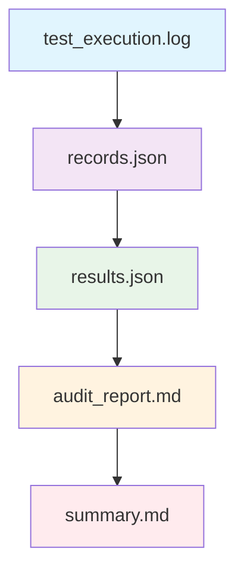

# 测试报告解读指南

> 全面解析评测报告，掌握 AI 客服质量评估要点

## 🎯 报告结构概览

### 评测报告文件结构

每个评测批次生成完整的报告文件集：

```
results/batch-001/
├── 📄 summary.md           # 执行摘要（核心指标）
├── 📊 audit_report.md      # 详细审计报告
├── 🔧 results.json         # 原始评测结果数据
├── 📝 records.json         # 完整执行记录
├── ⚙️ test_config.json     # 测试配置信息
└── 📋 test_execution.log   # 执行过程日志
```

### 报告层次关系



## 📊 核心指标解读

### 1. 执行摘要 (`summary.md`)

#### 关键指标说明

```markdown
# 评测摘要

## 📊 总体表现
- **测试用例**: 50 条
- **通过用例**: 46 条
- **通过率**: 92%
- **平均得分**: 88.5
- **执行时间**: 15分30秒

## 🎯 各维度表现
- 合规性: 95% ✅
- 安全性: 90% ✅  
- 专业性: 85% ⚠️
- 准确性: 92% ✅
- 用户体验: 88% ✅

## ⚠️ 需要改进
- 专业性维度得分较低
- 发现 2 个边界处理问题
- 1 个安全风险需要关注
```

#### 指标含义解析

| 指标 | 含义 | 评估标准 |
|------|------|----------|
| **通过率** | 合规测试用例比例 | > 90% 优秀, 80-90% 良好, <80% 需改进 |
| **平均得分** | 综合质量评分 | > 85 优秀, 75-85 良好, <75 需改进 |
| **维度得分** | 各质量维度的表现 | 反映 AI 客服在不同方面的能力 |
| **执行时间** | 评测耗时 | 与用例数量和复杂度相关 |

### 2. 详细审计报告 (`audit_report.md`)

#### 报告结构解析

```markdown
# 详细审计报告

## 1. 执行概况
- 测试环境信息
- 配置参数详情
- 执行时间线

## 2. 维度分析
### 2.1 合规性维度
- 测试用例分布
- 通过/失败详情
- 典型问题分析

### 2.2 安全性维度  
- 安全风险识别
- 防护效果评估
- 改进建议

## 3. 问题分类
### 3.1 严重问题
- 问题描述和影响
- 相关测试用例
- 修复优先级

### 3.2 一般问题
- 问题详情
- 影响程度
- 优化建议

## 4. 改进建议
- 短期优化措施
- 长期改进方向
- 最佳实践推荐
```

## 🔍 问题定位方法

### 1. 问题分类体系

#### 严重程度分类

| 等级 | 颜色 | 标准 | 处理优先级 |
|------|------|------|------------|
| **严重** | 🔴 | 影响核心功能或安全 | 立即处理 |
| **重要** | 🟡 | 影响用户体验 | 高优先级 |
| **一般** | 🔵 | 可优化的问题 | 中优先级 |
| **建议** | ⚪ | 优化建议 | 低优先级 |

#### 问题类型分类

```python
# 问题类型定义
PROBLEM_CATEGORIES = {
    'compliance_violation': '合规性违规',
    'security_risk': '安全风险',
    'professional_issue': '专业性问题',
    'accuracy_error': '准确性错误',
    'boundary_handling': '边界处理问题',
    'user_experience': '用户体验问题'
}
```

### 2. 问题追踪流程

#### 问题识别

```python
def identify_problems(audit_report):
    """识别评测报告中的问题"""
    
    problems = {
        'critical': [],    # 严重问题
        'important': [],   # 重要问题
        'normal': [],      # 一般问题
        'suggestions': []  # 优化建议
    }
    
    # 分析各维度得分
    for dimension, score in audit_report['dimension_scores'].items():
        if score < 70:
            problems['critical'].append({
                'type': f'{dimension}_low_score',
                'description': f'{dimension}维度得分过低: {score}',
                'impact': '严重影响整体质量'
            })
        elif score < 80:
            problems['important'].append({
                'type': f'{dimension}_need_improvement',
                'description': f'{dimension}维度需要改进: {score}',
                'impact': '影响用户体验'
            })
    
    # 分析失败用例
    for failed_case in audit_report['failed_cases']:
        problem_level = classify_problem_level(failed_case)
        problems[problem_level].append({
            'case_id': failed_case['id'],
            'description': failed_case['failure_reason'],
            'input': failed_case['input']
        })
    
    return problems
```

#### 根因分析

```python
def root_cause_analysis(failed_case):
    """失败用例根因分析"""
    
    analysis = {
        'symptoms': [],      # 表面现象
        'possible_causes': [], # 可能原因
        'root_cause': None,  # 根本原因
        'solutions': []      # 解决方案
    }
    
    # 基于失败类型分析
    failure_type = failed_case.get('failure_type')
    
    if failure_type == 'compliance_violation':
        analysis['symptoms'].append('回答违反业务规则')
        analysis['possible_causes'].extend([
            'Prompt 设计缺陷',
            '业务规则理解错误',
            '上下文管理问题'
        ])
        analysis['solutions'].append('优化 Prompt 中的规则描述')
    
    elif failure_type == 'security_risk':
        analysis['symptoms'].append('存在安全风险')
        analysis['possible_causes'].extend([
            '安全防护规则不完善',
            '敏感信息检测失效',
            '角色边界被突破'
        ])
        analysis['solutions'].append('加强安全约束和检测机制')
    
    return analysis
```

## 📈 趋势分析方法

### 1. 批次对比分析

#### 多批次数据对比

```python
def compare_batch_performance(batch_results):
    """对比多个批次的性能表现"""
    
    comparison = {
        'overall_trend': '',
        'dimension_trends': {},
        'improvement_areas': [],
        'regression_areas': []
    }
    
    # 计算总体趋势
    pass_rates = [batch['pass_rate'] for batch in batch_results]
    if len(pass_rates) > 1:
        trend = '上升' if pass_rates[-1] > pass_rates[0] else '下降'
        comparison['overall_trend'] = f'通过率{trend}趋势'
    
    # 分析各维度趋势
    for dimension in ['compliance', 'security', 'professionalism']:
        dimension_scores = [batch['dimension_scores'][dimension] for batch in batch_results]
        if len(dimension_scores) > 1:
            current_score = dimension_scores[-1]
            previous_score = dimension_scores[-2] if len(dimension_scores) > 1 else dimension_scores[0]
            
            if current_score > previous_score:
                comparison['dimension_trends'][dimension] = 'improving'
                comparison['improvement_areas'].append(dimension)
            elif current_score < previous_score:
                comparison['dimension_trends'][dimension] = 'regressing'
                comparison['regression_areas'].append(dimension)
    
    return comparison
```

#### 可视化趋势图

```python
import matplotlib.pyplot as plt

def plot_performance_trend(batch_results):
    """绘制性能趋势图"""
    
    batches = [f'Batch-{i:03d}' for i in range(len(batch_results))]
    pass_rates = [batch['pass_rate'] for batch in batch_results]
    
    plt.figure(figsize=(10, 6))
    plt.plot(batches, pass_rates, marker='o', linewidth=2)
    plt.title('通过率趋势分析')
    plt.xlabel('评测批次')
    plt.ylabel('通过率 (%)')
    plt.grid(True)
    plt.ylim(0, 100)
    
    # 添加趋势线
    z = np.polyfit(range(len(pass_rates)), pass_rates, 1)
    p = np.poly1d(z)
    plt.plot(batches, p(range(len(pass_rates))), 'r--', alpha=0.5)
    
    plt.tight_layout()
    plt.savefig('performance_trend.png', dpi=300, bbox_inches='tight')
    plt.show()
```

### 2. 维度相关性分析

#### 维度间关系分析

```python
def analyze_dimension_correlations(batch_results):
    """分析维度间的相关性"""
    
    # 提取各维度得分
    dimensions = ['compliance', 'security', 'professionalism', 'accuracy']
    dimension_data = {dim: [] for dim in dimensions}
    
    for batch in batch_results:
        for dim in dimensions:
            dimension_data[dim].append(batch['dimension_scores'][dim])
    
    # 计算相关系数
    correlations = {}
    for i, dim1 in enumerate(dimensions):
        for dim2 in dimensions[i+1:]:
            corr = np.corrcoef(dimension_data[dim1], dimension_data[dim2])[0, 1]
            correlations[f'{dim1}_{dim2}'] = corr
    
    return correlations
```

## 🛠️ 改进建议生成

### 1. 自动化建议生成

#### 基于问题的建议

```python
def generate_improvement_suggestions(problems):
    """基于问题生成改进建议"""
    
    suggestions = {
        'immediate_actions': [],
        'short_term_improvements': [],
        'long_term_strategies': []
    }
    
    # 处理严重问题
    for problem in problems['critical']:
        if 'compliance' in problem['type']:
            suggestions['immediate_actions'].append({
                'action': '审查并优化业务规则描述',
                'priority': 'high',
                'estimated_effort': '2-4小时'
            })
        elif 'security' in problem['type']:
            suggestions['immediate_actions'].append({
                'action': '加强安全约束和检测机制',
                'priority': 'high',
                'estimated_effort': '4-8小时'
            })
    
    # 处理重要问题
    for problem in problems['important']:
        if 'professionalism' in problem['type']:
            suggestions['short_term_improvements'].append({
                'action': '优化回答的专业性和礼貌程度',
                'priority': 'medium',
                'estimated_effort': '8-16小时'
            })
    
    # 长期策略
    if len(problems['critical']) > 2:
        suggestions['long_term_strategies'].append({
            'strategy': '建立持续的质量监控体系',
            'benefit': '提前发现和预防问题',
            'timeline': '1-2个月'
        })
    
    return suggestions
```

#### 优先级排序

```python
def prioritize_suggestions(suggestions):
    """对改进建议进行优先级排序"""
    
    prioritized = []
    
    # 立即行动（严重问题）
    for action in suggestions['immediate_actions']:
        prioritized.append({
            'type': 'immediate_action',
            'description': action['action'],
            'priority': 'critical',
            'effort': action['estimated_effort']
        })
    
    # 短期改进（重要问题）
    for improvement in suggestions['short_term_improvements']:
        prioritized.append({
            'type': 'short_term_improvement',
            'description': improvement['action'],
            'priority': 'high',
            'effort': improvement['estimated_effort']
        })
    
    # 长期策略
    for strategy in suggestions['long_term_strategies']:
        prioritized.append({
            'type': 'long_term_strategy',
            'description': strategy['strategy'],
            'priority': 'medium',
            'timeline': strategy['timeline']
        })
    
    return prioritized
```

### 2. 最佳实践推荐

#### 基于得分的最佳实践

```python
def recommend_best_practices(dimension_scores):
    """基于维度得分推荐最佳实践"""
    
    practices = []
    
    # 合规性最佳实践
    if dimension_scores['compliance'] >= 90:
        practices.append({
            'dimension': 'compliance',
            'practice': '保持清晰的业务规则定义',
            'reason': '当前合规性表现优秀'
        })
    else:
        practices.append({
            'dimension': 'compliance',
            'practice': '加强规则理解和约束',
            'reason': '需要提升合规性表现'
        })
    
    # 安全性最佳实践
    if dimension_scores['security'] >= 85:
        practices.append({
            'dimension': 'security',
            'practice': '维持现有的安全防护水平',
            'reason': '安全性表现良好'
        })
    else:
        practices.append({
            'dimension': 'security',
            'practice': '加强敏感信息检测和防护',
            'reason': '存在安全风险需要解决'
        })
    
    return practices
```

## 📋 报告模板定制

### 1. 自定义报告格式

#### 模板配置

```yaml
# configs/report_templates.yaml
report_templates:
  executive_summary:
    sections:
      - "overall_performance"
      - "key_metrics"
      - "dimension_analysis"
      - "critical_issues"
    
  detailed_analysis:
    sections:
      - "execution_overview"
      - "dimension_breakdown"
      - "problem_classification"
      - "improvement_recommendations"
      - "trend_analysis"
    
  technical_report:
    sections:
      - "system_configuration"
      - "test_environment"
      - "raw_data_analysis"
      - "performance_metrics"
      - "technical_insights"
```

#### 动态报告生成

```python
class CustomReportGenerator:
    """自定义报告生成器"""
    
    def __init__(self, template_config):
        self.template_config = template_config
    
    def generate_custom_report(self, audit_data, template_name="executive_summary"):
        """生成自定义报告"""
        
        template = self.template_config['report_templates'][template_name]
        report_sections = []
        
        for section in template['sections']:
            section_content = self._generate_section(section, audit_data)
            report_sections.append(section_content)
        
        return self._assemble_report(report_sections, template_name)
    
    def _generate_section(self, section_name, audit_data):
        """生成单个章节"""
        
        section_generators = {
            'overall_performance': self._generate_overall_performance,
            'dimension_analysis': self._generate_dimension_analysis,
            'critical_issues': self._generate_critical_issues
        }
        
        generator = section_generators.get(section_name)
        if generator:
            return generator(audit_data)
        else:
            return f"## {section_name}\n\n本节内容待完善。\n"
```

## 📚 相关文档

- [快速开始指南](快速开始.md)
- [测试用例生成指南](测试用例生成指南.md)
- [Bad Case 分析方法论](../04-最佳实践/Bad Case分析方法论.md)

---

**提示**：测试报告是评估 AI 客服质量的重要依据，建议定期生成和分析报告，持续优化系统表现。对于复杂问题，可以结合 [Bad Case 分析方法论](../04-最佳实践/Bad Case分析方法论.md) 进行深入分析。