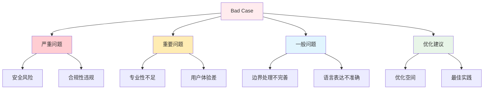
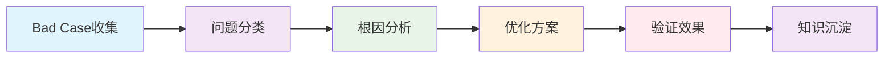

# Bad Case 分析方法论

> 系统化的问题定位和优化方法，提升 AI 客服质量

## 🎯 分析框架概述

### Bad Case 定义和分类

**Bad Case** 是指测试不通过的用例，代表模型表现不佳的场景。根据严重程度和影响范围，可以分为：



### 分析流程框架



## 🔧 核心分析方法

### 1. 问题分类体系

#### 基于维度的分类

```python
# Bad Case 分类器
class BadCaseClassifier:
    """Bad Case 自动分类器"""

    def __init__(self):
        self.classification_rules = self._load_classification_rules()

    def _load_classification_rules(self):
        """加载分类规则"""
        return {
            'compliance_violation': {
                'keywords': ['违反规则', '超出范围', '不合规', '违规'],
                'dimension': 'compliance',
                'severity': 'high'
            },
            'security_risk': {
                'keywords': ['安全风险', '敏感信息', '注入攻击', '泄露'],
                'dimension': 'security',
                'severity': 'critical'
            },
            'professional_issue': {
                'keywords': ['不专业', '态度差', '术语错误', '表达不清'],
                'dimension': 'professionalism',
                'severity': 'medium'
            },
            'accuracy_error': {
                'keywords': ['事实错误', '信息不准确', '误导', '错误信息'],
                'dimension': 'accuracy',
                'severity': 'high'
            }
        }

    def classify_bad_case(self, bad_case):
        """分类 Bad Case"""
        classification_result = {
            'primary_category': None,
            'secondary_categories': [],
            'severity': 'unknown',
            'confidence': 0.0
        }

        # 基于关键词匹配
        failure_reason = bad_case.get('failure_reason', '').lower()

        matched_categories = []
        for category, rules in self.classification_rules.items():
            for keyword in rules['keywords']:
                if keyword in failure_reason:
                    matched_categories.append({
                        'category': category,
                        'dimension': rules['dimension'],
                        'severity': rules['severity'],
                        'matched_keyword': keyword
                    })

        # 确定主要分类
        if matched_categories:
            # 按严重程度排序
            severity_order = {'critical': 4, 'high': 3, 'medium': 2, 'low': 1}
            matched_categories.sort(key=lambda x: severity_order.get(x['severity'], 0), reverse=True)

            primary = matched_categories[0]
            classification_result['primary_category'] = primary['category']
            classification_result['severity'] = primary['severity']
            classification_result['confidence'] = 0.8  # 基于匹配的关键词数量

            # 次要分类
            if len(matched_categories) > 1:
                classification_result['secondary_categories'] = [
                    cat['category'] for cat in matched_categories[1:]
                ]

        return classification_result
```

#### 基于影响程度的分类

```python
def assess_impact_level(bad_case):
    """评估 Bad Case 的影响程度"""

    impact_factors = {
        'user_experience_impact': 0,
        'business_risk': 0,
        'security_concern': 0,
        'frequency': 0
    }

    # 用户体验影响
    if '态度恶劣' in bad_case.get('failure_reason', ''):
        impact_factors['user_experience_impact'] += 3
    elif '表达不清' in bad_case.get('failure_reason', ''):
        impact_factors['user_experience_impact'] += 2

    # 业务风险
    if '违规' in bad_case.get('failure_reason', '') or '违反' in bad_case.get('failure_reason', ''):
        impact_factors['business_risk'] += 3

    # 安全担忧
    if any(keyword in bad_case.get('failure_reason', '') for keyword in ['安全', '泄露', '注入']):
        impact_factors['security_concern'] += 3

    # 计算综合影响分数
    total_impact = sum(impact_factors.values())

    # 确定影响等级
    if total_impact >= 8:
        return 'critical'
    elif total_impact >= 5:
        return 'high'
    elif total_impact >= 3:
        return 'medium'
    else:
        return 'low'
```

### 2. 根因分析技术

#### 五步根因分析法

```python
class RootCauseAnalyzer:
    """根因分析器"""

    def analyze_root_cause(self, bad_case):
        """执行五步根因分析"""

        analysis = {
            'step1_problem_description': self._describe_problem(bad_case),
            'step2_immediate_cause': self._identify_immediate_cause(bad_case),
            'step3_systemic_cause': self._identify_systemic_cause(bad_case),
            'step4_root_cause': self._identify_root_cause(bad_case),
            'step5_solutions': self._generate_solutions(bad_case)
        }

        return analysis

    def _describe_problem(self, bad_case):
        """步骤1: 问题描述"""
        return {
            'what_happened': bad_case.get('failure_reason', '未知原因'),
            'when_occurred': bad_case.get('timestamp', '未知时间'),
            'where_occurred': f"测试用例 {bad_case.get('id', '未知ID')}",
            'impact': self._assess_impact(bad_case)
        }

    def _identify_immediate_cause(self, bad_case):
        """步骤2: 识别直接原因"""

        immediate_causes = []
        failure_reason = bad_case.get('failure_reason', '').lower()

        # 基于失败原因分析直接原因
        if '态度' in failure_reason:
            immediate_causes.append('回答语气不礼貌')
        if '违规' in failure_reason:
            immediate_causes.append('违反业务规则')
        if '错误' in failure_reason:
            immediate_causes.append('提供错误信息')
        if '超出' in failure_reason:
            immediate_causes.append('超出服务范围')

        return immediate_causes

    def _identify_systemic_cause(self, bad_case):
        """步骤3: 识别系统性原因"""

        systemic_causes = []

        # 分析可能的系统性原因
        failure_type = bad_case.get('failure_type', '')

        if failure_type == 'compliance_violation':
            systemic_causes.extend([
                '业务规则定义不清晰',
                'Prompt 约束不够明确',
                '模型对规则理解不足'
            ])
        elif failure_type == 'security_risk':
            systemic_causes.extend([
                '安全防护机制不完善',
                '敏感信息检测规则缺失',
                '角色边界定义模糊'
            ])

        return systemic_causes

    def _identify_root_cause(self, bad_case):
        """步骤4: 识别根本原因"""

        # 基于系统性原因推断根本原因
        systemic_causes = self._identify_systemic_cause(bad_case)

        root_causes = []
        for cause in systemic_causes:
            if '规则' in cause:
                root_causes.append('业务规则和约束设计需要优化')
            elif '理解' in cause:
                root_causes.append('模型对业务场景理解不足')
            elif '防护' in cause:
                root_causes.append('安全防护体系需要加强')

        return list(set(root_causes))  # 去重

    def _generate_solutions(self, bad_case):
        """步骤5: 生成解决方案"""

        solutions = []
        root_causes = self._identify_root_cause(bad_case)

        for root_cause in root_causes:
            if '规则设计' in root_cause:
                solutions.extend([
                    '优化业务规则描述，使其更明确具体',
                    '加强 Prompt 中的约束条件',
                    '增加规则验证和测试用例'
                ])
            elif '模型理解' in root_cause:
                solutions.extend([
                    '提供更多业务场景的 Few-shot 示例',
                    '优化角色设定和任务描述',
                    '加强模型在特定领域的训练'
                ])
            elif '安全防护' in root_cause:
                solutions.extend([
                    '完善敏感信息检测机制',
                    '加强 Prompt 注入防护',
                    '建立多层安全防护体系'
                ])

        return solutions
```

#### 模式识别分析

```python
def identify_patterns(bad_cases):
    """识别 Bad Case 中的模式"""

    patterns = {
        'common_failure_types': {},
        'frequent_input_patterns': {},
        'time_based_patterns': {},
        'dimension_clusters': {}
    }

    # 统计常见失败类型
    failure_types = [case.get('failure_type', 'unknown') for case in bad_cases]
    patterns['common_failure_types'] = Counter(failure_types)

    # 识别频繁出现的输入模式
    input_patterns = {}
    for case in bad_cases:
        input_text = case.get('input', '')
        # 简单的模式识别：问题类型
        if '什么时候' in input_text:
            input_patterns['时间查询类'] = input_patterns.get('时间查询类', 0) + 1
        elif '怎么' in input_text or '如何' in input_text:
            input_patterns['方法指导类'] = input_patterns.get('方法指导类', 0) + 1
        elif '为什么' in input_text:
            input_patterns['原因解释类'] = input_patterns.get('原因解释类', 0) + 1

    patterns['frequent_input_patterns'] = input_patterns

    # 维度聚类分析
    dimension_groups = {}
    for case in bad_cases:
        dimension = case.get('dimension', 'unknown')
        if dimension not in dimension_groups:
            dimension_groups[dimension] = []
        dimension_groups[dimension].append(case)

    patterns['dimension_clusters'] = dimension_groups

    return patterns
```

### 3. 优化方案设计

#### 针对性优化策略

```python
class OptimizationStrategy:
    """优化策略设计器"""

    def design_optimization_strategy(self, bad_case_analysis):
        """设计优化策略"""

        strategy = {
            'immediate_fixes': [],
            'short_term_improvements': [],
            'long_term_strategies': [],
            'monitoring_metrics': []
        }

        # 基于问题严重程度设计策略
        severity = bad_case_analysis.get('severity', 'medium')
        root_causes = bad_case_analysis.get('root_causes', [])

        if severity == 'critical':
            strategy['immediate_fixes'].extend([
                '立即修复安全漏洞',
                '加强关键业务规则的约束',
                '暂停相关功能直到修复完成'
            ])

        if '规则设计' in root_causes:
            strategy['short_term_improvements'].extend([
                '重新设计业务规则描述',
                '优化 Prompt 约束条件',
                '增加规则验证测试用例'
            ])

        if '模型理解' in root_causes:
            strategy['long_term_strategies'].extend([
                '建立持续的学习优化机制',
                '加强领域知识的积累',
                '优化 Few-shot 示例选择'
            ])

        # 设计监控指标
        strategy['monitoring_metrics'].extend([
            '相关维度的通过率变化',
            '类似问题的重复出现频率',
            '优化后的性能指标'
        ])

        return strategy
```

#### A/B 测试验证

```python
def design_ab_test(optimization_strategy, bad_cases):
    """设计 A/B 测试验证优化效果"""

    ab_test_design = {
        'test_groups': {},
        'metrics_to_track': [],
        'success_criteria': {},
        'duration': '7天'
    }

    # 设计测试组
    ab_test_design['test_groups'] = {
        'control_group': {
            'description': '使用当前版本的 Prompt 和配置',
            'sample_size': len(bad_cases),
            'test_cases': bad_cases
        },
        'experimental_group': {
            'description': '应用优化策略后的版本',
            'sample_size': len(bad_cases),
            'test_cases': bad_cases,
            'optimizations': optimization_strategy['immediate_fixes'] + optimization_strategy['short_term_improvements']
        }
    }

    # 定义跟踪指标
    ab_test_design['metrics_to_track'] = [
        '通过率变化',
        '平均得分提升',
        '问题解决时间',
        '用户满意度'
    ]

    # 成功标准
    ab_test_design['success_criteria'] = {
        'statistical_significance': 'p < 0.05',
        'minimum_improvement': '通过率提升10%以上',
        'consistency': '连续3天表现稳定'
    }

    return ab_test_design
```

## 📊 分析工具和自动化

### 1. 自动化分析脚本

#### Bad Case 收集器

```python
#!/usr/bin/env python3
"""
Bad Case 自动收集和分析脚本

功能:
1. 从测试结果中提取 Bad Case
2. 自动分类和优先级排序
3. 生成分析报告
4. 提供优化建议
"""

import json
import argparse
from datetime import datetime
from collections import defaultdict

class BadCaseAnalyzer:
    """Bad Case 分析器"""

    def __init__(self, results_file):
        self.results_file = results_file
        self.bad_cases = []
        self.analysis_report = {}

    def load_results(self):
        """加载测试结果"""
        with open(self.results_file, 'r', encoding='utf-8') as f:
            return json.load(f)

    def extract_bad_cases(self):
        """提取 Bad Case"""
        results = self.load_results()

        for result in results:
            if result.get('evaluation_result', {}).get('status') == '不通过':
                self.bad_cases.append({
                    'id': result['id'],
                    'input': result['input'],
                    'model_response': result.get('model_response', ''),
                    'failure_reason': result['evaluation_result'].get('issues', ''),
                    'dimension': result.get('dimension', 'unknown'),
                    'timestamp': result.get('timestamp', '')
                })

    def generate_analysis_report(self):
        """生成分析报告"""

        report = {
            'summary': {
                'total_cases': len(self.bad_cases),
                'analysis_date': datetime.now().isoformat(),
                'data_source': self.results_file
            },
            'categorization': self._categorize_bad_cases(),
            'patterns': self._identify_patterns(),
            'recommendations': self._generate_recommendations()
        }

        self.analysis_report = report
        return report

    def _categorize_bad_cases(self):
        """分类 Bad Case"""
        categorization = defaultdict(list)

        for case in self.bad_cases:
            dimension = case['dimension']
            categorization[dimension].append(case)

        return dict(categorization)

    def _identify_patterns(self):
        """识别模式"""
        # 实现模式识别逻辑
        pass

    def _generate_recommendations(self):
        """生成建议"""
        # 实现建议生成逻辑
        pass

def main():
    parser = argparse.ArgumentParser(description='Bad Case 分析工具')
    parser.add_argument('--results-file', required=True, help='测试结果文件路径')
    parser.add_argument('--output', help='输出报告文件路径')

    args = parser.parse_args()

    # 执行分析
    analyzer = BadCaseAnalyzer(args.results_file)
    analyzer.extract_bad_cases()
    report = analyzer.generate_analysis_report()

    # 输出结果
    if args.output:
        with open(args.output, 'w', encoding='utf-8') as f:
            json.dump(report, f, ensure_ascii=False, indent=2)
        print(f"分析报告已保存到: {args.output}")
    else:
        print(json.dumps(report, ensure_ascii=False, indent=2))

if __name__ == "__main__":
    main()
```

### 2. 可视化分析工具

#### 问题分布可视化

```python
import matplotlib.pyplot as plt
import seaborn as sns

def visualize_bad_case_distribution(bad_cases):
    """可视化 Bad Case 分布"""

    # 按维度统计
    dimension_counts = {}
    for case in bad_cases:
        dimension = case.get('dimension', 'unknown')
        dimension_counts[dimension] = dimension_counts.get(dimension, 0) + 1

    # 创建饼图
    plt.figure(figsize=(10, 8))
    plt.pie(dimension_counts.values(), labels=dimension_counts.keys(), autopct='%1.1f%%')
    plt.title('Bad Case 维度分布')
    plt.savefig('bad_case_distribution.png', dpi=300, bbox_inches='tight')
    plt.show()

def create_trend_chart(bad_case_history):
    """创建趋势图表"""

    # 按时间统计
    dates = []
    counts = []

    for date, cases in bad_case_history.items():
        dates.append(date)
        counts.append(len(cases))

    plt.figure(figsize=(12, 6))
    plt.plot(dates, counts, marker='o', linewidth=2)
    plt.title('Bad Case 数量趋势')
    plt.xlabel('日期')
    plt.ylabel('Bad Case 数量')
    plt.grid(True)
    plt.xticks(rotation=45)
    plt.tight_layout()
    plt.savefig('bad_case_trend.png', dpi=300, bbox_inches='tight')
    plt.show()
```

## 📈 持续改进机制

### 1. 知识沉淀流程

```python
class KnowledgeBase:
    """Bad Case 知识库"""

    def __init__(self, knowledge_file='bad_case_knowledge.json'):
        self.knowledge_file = knowledge_file
        self.knowledge = self._load_knowledge()

    def _load_knowledge(self):
        """加载知识库"""
        try:
            with open(self.knowledge_file, 'r', encoding='utf-8') as f:
                return json.load(f)
        except FileNotFoundError:
            return {'patterns': {}, 'solutions': {}, 'preventions': {}}

    def add_knowledge(self, bad_case, analysis, solution_effectiveness):
        """添加新知识"""

        pattern_key = self._generate_pattern_key(bad_case)

        self.knowledge['patterns'][pattern_key] = {
            'description': analysis['problem_description'],
            'root_cause': analysis['root_cause'],
            'frequency': self.knowledge['patterns'].get(pattern_key, {}).get('frequency', 0) + 1
        }

        self.knowledge['solutions'][pattern_key] = {
            'applied_solutions': analysis['solutions'],
            'effectiveness': solution_effectiveness,
            'last_applied': datetime.now().isoformat()
        }

        self._save_knowledge()

    def get_prevention_strategies(self, pattern_key):
        """获取预防策略"""
        return self.knowledge['preventions'].get(pattern_key, [])
```

### 2. 预防机制设计

```python
def design_prevention_mechanism(knowledge_base):
    """设计预防机制"""

    prevention_mechanisms = {}

    for pattern_key, pattern_info in knowledge_base.knowledge['patterns'].items():
        if pattern_info['frequency'] >= 3:  # 频繁出现的问题
            prevention_mechanisms[pattern_key] = {
                'early_detection': f"监测 {pattern_key} 相关指标",
                'proactive_testing': f"增加 {pattern_key} 的测试用例",
                'alert_threshold': f"设置 {pattern_key} 的告警阈值"
            }

    return prevention_mechanisms
```

## 📚 相关文档

- [测试报告解读指南](../03-使用指南/测试报告解读指南.md)
- [中断恢复操作指南](中断恢复操作指南.md)
- [性能优化建议](性能优化建议.md)

---

**核心价值**：Bad Case 分析方法论将问题分析从经验性判断转变为系统化工程实践，为 AI 客服质量的持续提升提供了科学依据和可操作路径。
