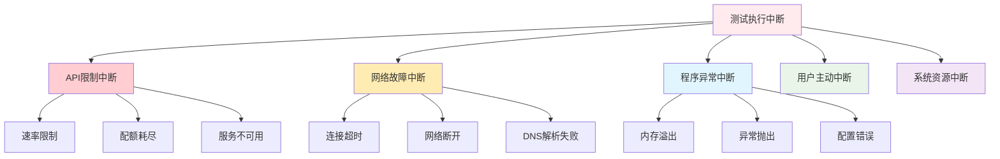

# 中断恢复操作指南

> 系统化处理测试执行中断，确保评测过程的可恢复性和完整性

## 🎯 中断场景分析

### 常见中断类型



### 中断影响评估

| 中断类型 | 恢复难度 | 数据丢失风险 | 恢复时间 |
|----------|----------|--------------|----------|
| **API限制中断** | 容易 | 低 | 分钟级 |
| **网络故障中断** | 中等 | 中 | 分钟级 |
| **程序异常中断** | 困难 | 高 | 小时级 |
| **用户主动中断** | 容易 | 低 | 分钟级 |
| **系统资源中断** | 困难 | 高 | 小时级 |

## 🔧 恢复流程设计

### 完整恢复流程


### 恢复策略选择矩阵

```python
class RecoveryStrategySelector:
    """恢复策略选择器"""
    
    def __init__(self):
        self.strategy_matrix = self._build_strategy_matrix()
    
    def _build_strategy_matrix(self):
        """构建策略选择矩阵"""
        return {
            'api_limit': {
                'incremental': {'priority': 1, 'effectiveness': 0.9},
                'restart': {'priority': 2, 'effectiveness': 0.8},
                'reschedule': {'priority': 3, 'effectiveness': 0.7}
            },
            'network_failure': {
                'incremental': {'priority': 1, 'effectiveness': 0.8},
                'restart': {'priority': 2, 'effectiveness': 0.9},
                'reschedule': {'priority': 3, 'effectiveness': 0.6}
            },
            'program_crash': {
                'incremental': {'priority': 2, 'effectiveness': 0.6},
                'restart': {'priority': 1, 'effectiveness': 0.9},
                'reschedule': {'priority': 3, 'effectiveness': 0.7}
            },
            'user_interruption': {
                'incremental': {'priority': 1, 'effectiveness': 0.95},
                'restart': {'priority': 2, 'effectiveness': 0.8},
                'reschedule': {'priority': 3, 'effectiveness': 0.7}
            }
        }
    
    def select_strategy(self, interruption_type, context=None):
        """选择恢复策略"""
        
        if interruption_type not in self.strategy_matrix:
            return 'restart'  # 默认策略
        
        strategies = self.strategy_matrix[interruption_type]
        
        # 根据优先级选择
        sorted_strategies = sorted(
            strategies.items(), 
            key=lambda x: x[1]['priority']
        )
        
        return sorted_strategies[0][0]  # 返回优先级最高的策略
```

## 🛠️ 核心恢复技术

### 1. 增量恢复模式 (Incremental Mode)

#### 增量恢复实现

```python
class IncrementalRecovery:
    """增量恢复管理器"""
    
    def __init__(self, results_dir):
        self.results_dir = results_dir
        self.checkpoint_file = os.path.join(results_dir, 'recovery_checkpoint.json')
    
    def create_checkpoint(self, completed_cases, current_case=None):
        """创建恢复检查点"""
        
        checkpoint = {
            'timestamp': datetime.now().isoformat(),
            'completed_cases': completed_cases,
            'current_case': current_case,
            'total_cases': len(completed_cases) + (1 if current_case else 0),
            'recovery_count': self._get_recovery_count() + 1
        }
        
        with open(self.checkpoint_file, 'w', encoding='utf-8') as f:
            json.dump(checkpoint, f, ensure_ascii=False, indent=2)
    
    def load_checkpoint(self):
        """加载恢复检查点"""
        try:
            with open(self.checkpoint_file, 'r', encoding='utf-8') as f:
                return json.load(f)
        except FileNotFoundError:
            return None
    
    def get_remaining_cases(self, all_cases, checkpoint):
        """获取剩余测试用例"""
        
        completed_ids = set(case['id'] for case in checkpoint['completed_cases'])
        
        remaining_cases = []
        for case in all_cases:
            if case['id'] not in completed_ids:
                # 如果当前用例存在，从当前用例开始
                if checkpoint.get('current_case') and case['id'] == checkpoint['current_case']['id']:
                    remaining_cases.append(checkpoint['current_case'])
                else:
                    remaining_cases.append(case)
        
        return remaining_cases
    
    def _get_recovery_count(self):
        """获取恢复次数"""
        checkpoint = self.load_checkpoint()
        return checkpoint.get('recovery_count', 0) if checkpoint else 0
```

#### 增量恢复执行

```python
def execute_incremental_recovery(test_cases_path, results_dir):
    """执行增量恢复"""
    
    # 初始化恢复管理器
    recovery_manager = IncrementalRecovery(results_dir)
    
    # 加载检查点
    checkpoint = recovery_manager.load_checkpoint()
    
    if not checkpoint:
        print("❌ 未找到恢复检查点，无法执行增量恢复")
        return False
    
    print(f"🔍 找到恢复检查点，已完成 {len(checkpoint['completed_cases'])} 个用例")
    
    # 加载所有测试用例
    with open(test_cases_path, 'r', encoding='utf-8') as f:
        all_cases = json.load(f)['test_cases']
    
    # 获取剩余用例
    remaining_cases = recovery_manager.get_remaining_cases(all_cases, checkpoint)
    
    if not remaining_cases:
        print("✅ 所有用例已完成，无需恢复")
        return True
    
    print(f"🔄 开始恢复执行，剩余 {len(remaining_cases)} 个用例")
    
    # 初始化测试执行器
    test_runner = TestRunner(api_key, evaluator_template_path)
    
    # 执行剩余用例
    for i, test_case in enumerate(remaining_cases, 1):
        print(f"📋 执行用例 {i}/{len(remaining_cases)}: {test_case['id']}")
        
        try:
            # 执行单个用例
            result = test_runner.execute_single_case(test_case)
            
            # 更新检查点
            completed_cases = checkpoint['completed_cases'] + [result]
            recovery_manager.create_checkpoint(completed_cases, test_case if i < len(remaining_cases) else None)
            
            print(f"✅ 用例 {test_case['id']} 完成")
            
        except Exception as e:
            print(f"❌ 用例 {test_case['id']} 执行失败: {e}")
            
            # 更新检查点（记录失败信息）
            recovery_manager.create_checkpoint(
                checkpoint['completed_cases'], 
                {'case': test_case, 'error': str(e)}
            )
            
            # 根据错误类型决定是否继续
            if isinstance(e, (APIError, NetworkError)):
                print("⚠️  API或网络错误，暂停执行")
                return False
            else:
                print("⚠️  程序错误，继续执行下一个用例")
                continue
    
    print("✅ 增量恢复完成")
    return True
```

### 2. 环境一致性检查

#### 环境验证工具

```python
class EnvironmentValidator:
    """环境验证器"""
    
    def __init__(self, config_registry):
        self.registry = config_registry
    
    def validate_environment_consistency(self, checkpoint_config, current_config):
        """验证环境一致性"""
        
        inconsistencies = []
        
        # 检查模型配置
        if checkpoint_config.get('model') != current_config.get('model'):
            inconsistencies.append({
                'component': 'model_config',
                'checkpoint_value': checkpoint_config.get('model'),
                'current_value': current_config.get('model'),
                'impact': '高 - 评测结果不可比'
            })
        
        # 检查API端点
        if checkpoint_config.get('api_endpoint') != current_config.get('api_endpoint'):
            inconsistencies.append({
                'component': 'api_endpoint',
                'checkpoint_value': checkpoint_config.get('api_endpoint'),
                'current_value': current_config.get('api_endpoint'),
                'impact': '中 - 可能影响性能'
            })
        
        # 检查业务场景
        if checkpoint_config.get('scenario') != current_config.get('scenario'):
            inconsistencies.append({
                'component': 'business_scenario',
                'checkpoint_value': checkpoint_config.get('scenario'),
                'current_value': current_config.get('scenario'),
                'impact': '高 - 评测标准不同'
            })
        
        return inconsistencies
    
    def get_recovery_recommendation(self, inconsistencies):
        """获取恢复建议"""
        
        high_impact_issues = [issue for issue in inconsistencies if issue['impact'] == '高']
        
        if high_impact_issues:
            return {
                'recommendation': '不建议恢复，建议新建批次',
                'reason': '存在高影响的环境不一致问题',
                'issues': high_impact_issues
            }
        else:
            return {
                'recommendation': '可以安全恢复',
                'reason': '环境差异在可接受范围内',
                'issues': inconsistencies
            }
```

### 3. 智能重试机制

#### 自适应重试策略

```python
class SmartRetryManager:
    """智能重试管理器"""
    
    def __init__(self, max_retries=3, base_delay=1, max_delay=60):
        self.max_retries = max_retries
        self.base_delay = base_delay
        self.max_delay = max_delay
        self.retry_history = {}
    
    def should_retry(self, error, case_id):
        """判断是否应该重试"""
        
        # 记录重试历史
        if case_id not in self.retry_history:
            self.retry_history[case_id] = {'count': 0, 'last_error': None}
        
        history = self.retry_history[case_id]
        
        # 检查重试次数
        if history['count'] >= self.max_retries:
            return False
        
        # 根据错误类型决定重试策略
        error_type = self._classify_error(error)
        
        if error_type in ['api_limit', 'network_timeout', 'server_error']:
            return True
        elif error_type in ['client_error', 'authentication_error']:
            return False  # 客户端错误通常不需要重试
        else:
            return history['count'] < 2  # 其他错误最多重试2次
    
    def get_retry_delay(self, case_id, error):
        """计算重试延迟"""
        
        history = self.retry_history[case_id]
        retry_count = history['count']
        
        # 指数退避策略
        delay = min(self.base_delay * (2 ** retry_count), self.max_delay)
        
        # 根据错误类型调整延迟
        error_type = self._classify_error(error)
        if error_type == 'api_limit':
            delay = max(delay, 30)  # API限制至少等待30秒
        
        return delay
    
    def record_retry(self, case_id, error, success=False):
        """记录重试结果"""
        
        if case_id not in self.retry_history:
            self.retry_history[case_id] = {'count': 0, 'last_error': None}
        
        history = self.retry_history[case_id]
        
        if success:
            history['count'] = 0  # 成功重置计数
            history['last_error'] = None
        else:
            history['count'] += 1
            history['last_error'] = str(error)
    
    def _classify_error(self, error):
        """分类错误类型"""
        
        error_str = str(error).lower()
        
        if any(keyword in error_str for keyword in ['rate limit', 'quota', 'limit exceeded']):
            return 'api_limit'
        elif any(keyword in error_str for keyword in ['timeout', 'connection', 'network']):
            return 'network_timeout'
        elif any(keyword in error_str for keyword in ['server error', 'internal error', '5']):
            return 'server_error'
        elif any(keyword in error_str for keyword in ['client error', 'bad request', '4']):
            return 'client_error'
        elif any(keyword in error_str for keyword in ['authentication', 'unauthorized', 'forbidden']):
            return 'authentication_error'
        else:
            return 'unknown'
```

## 📋 操作步骤详解

### 步骤1: 检测中断情况

#### 检查执行日志

```bash
# 查看最后几条执行日志
tail -20 projects/01-ai-customer-service/results/batch-004/test_execution.log

# 输出示例
[2026-04-06 12:30:45] INFO  [45/80] TC-ACC-005 completed - 通过
[2026-04-06 12:30:47] INFO  [46/80] TC-ACC-006 started
[2026-04-06 12:31:02] ERROR [TC-ACC-006] API rate limit exceeded
```

#### 分析中断信息

```python
def analyze_interruption(log_file):
    """分析中断信息"""
    
    with open(log_file, 'r', encoding='utf-8') as f:
        logs = f.readlines()
    
    # 查找错误日志
    error_logs = [log for log in logs if 'ERROR' in log]
    
    if not error_logs:
        return {'type': 'unknown', 'message': '未找到错误信息'}
    
    last_error = error_logs[-1]
    
    # 分析错误类型
    if 'rate limit' in last_error.lower():
        return {'type': 'api_limit', 'message': 'API速率限制'}
    elif 'timeout' in last_error.lower() or 'connection' in last_error.lower():
        return {'type': 'network_failure', 'message': '网络连接问题'}
    elif 'memory' in last_error.lower():
        return {'type': 'resource_exhaustion', 'message': '资源耗尽'}
    else:
        return {'type': 'program_error', 'message': '程序异常'}
```

### 步骤2: 检查环境一致性

#### 验证配置一致性

```bash
# 检查测试配置
cat projects/01-ai-customer-service/results/batch-004/test_config.json | jq '.environment'

# 输出示例
{
  "model": "gpt-4",
  "api_endpoint": "https://api.openai.com/v1",
  "scenario": "default",
  "timestamp": "2026-04-06T12:30:00"
}
```

#### 对比当前环境

```python
def compare_environments(checkpoint_config, current_config):
    """对比环境配置"""
    
    validator = EnvironmentValidator(config_registry)
    inconsistencies = validator.validate_environment_consistency(checkpoint_config, current_config)
    
    recommendation = validator.get_recovery_recommendation(inconsistencies)
    
    print("🔍 环境一致性检查结果:")
    print(f"建议: {recommendation['recommendation']}")
    print(f"原因: {recommendation['reason']}")
    
    if inconsistencies:
        print("\n⚠️ 发现的环境差异:")
        for issue in inconsistencies:
            print(f"  - {issue['component']}: {issue['impact']}")
    
    return recommendation
```

### 步骤3: 执行恢复操作

#### 增量恢复命令

```bash
# 使用增量模式恢复测试
python scripts/run_tests.py --batch 004 --incremental

# 输出示例
🔍 找到恢复检查点，已完成 45 个用例
🔄 开始恢复执行，剩余 35 个用例
📋 执行用例 1/35: TC-ACC-006
✅ 用例 TC-ACC-006 完成
...
✅ 增量恢复完成: 80/80 用例执行完毕
```

#### 手动恢复流程

```python
def manual_recovery_procedure():
    """手动恢复流程"""
    
    print("🔄 开始手动恢复流程")
    
    # 1. 检查恢复可行性
    checkpoint = load_recovery_checkpoint()
    if not checkpoint:
        print("❌ 无法找到恢复点，建议重新开始")
        return False
    
    # 2. 验证环境一致性
    env_check = compare_environments(checkpoint['environment'], get_current_environment())
    if env_check['recommendation'] == '不建议恢复':
        print("❌ 环境不一致，不建议恢复")
        return False
    
    # 3. 执行恢复
    success = execute_incremental_recovery(
        test_cases_path='projects/01-ai-customer-service/cases/universal.json',
        results_dir='projects/01-ai-customer-service/results/batch-004'
    )
    
    if success:
        print("✅ 手动恢复成功")
        # 清理恢复检查点
        cleanup_recovery_checkpoint()
    else:
        print("❌ 手动恢复失败")
    
    return success
```

### 步骤4: 验证恢复结果

#### 结果完整性检查

```python
def validate_recovery_completeness(results_dir):
    """验证恢复完整性"""
    
    # 检查结果文件
    required_files = ['records.json', 'results.json', 'summary.md']
    
    missing_files = []
    for file in required_files:
        if not os.path.exists(os.path.join(results_dir, file)):
            missing_files.append(file)
    
    if missing_files:
        print(f"❌ 缺少必要文件: {missing_files}")
        return False
    
    # 检查用例完整性
    with open(os.path.join(results_dir, 'records.json'), 'r') as f:
        records = json.load(f)
    
    with open('projects/01-ai-customer-service/cases/universal.json', 'r') as f:
        expected_cases = json.load(f)['test_cases']
    
    executed_ids = set(record['test_case_id'] for record in records)
    expected_ids = set(case['id'] for case in expected_cases)
    
    missing_cases = expected_ids - executed_ids
    
    if missing_cases:
        print(f"❌ 缺失用例: {len(missing_cases)} 个")
        return False
    
    print("✅ 恢复完整性验证通过")
    return True
```

## 📊 恢复监控和报告

### 1. 恢复过程监控

```python
class RecoveryMonitor:
    """恢复过程监控器"""
    
    def __init__(self):
        self.metrics = {
            'start_time': None,
            'end_time': None,
            'cases_processed': 0,
            'cases_failed': 0,
            'retry_attempts': 0,
            'recovery_success_rate': 0.0
        }
        self.events = []
    
    def start_monitoring(self):
        """开始监控"""
        self.metrics['start_time'] = datetime.now()
        self._log_event('recovery_started', '恢复过程开始')
    
    def record_case_processed(self, case_id, success=True):
        """记录用例处理"""
        self.metrics['cases_processed'] += 1
        
        if not success:
            self.metrics['cases_failed'] += 1
        
        event_type = 'case_success' if success else 'case_failure'
        self._log_event(event_type, f'用例 {case_id} 处理完成')
    
    def record_retry(self, case_id):
        """记录重试"""
        self.metrics['retry_attempts'] += 1
        self._log_event('retry_attempt', f'用例 {case_id} 重试')
    
    def finish_monitoring(self, success=True):
        """结束监控"""
        self.metrics['end_time'] = datetime.now()
        
        # 计算成功率
        if self.metrics['cases_processed'] > 0:
            self.metrics['recovery_success_rate'] = (
                1 - self.metrics['cases_failed'] / self.metrics['cases_processed']
            )
        
        event_type = 'recovery_success' if success else 'recovery_failure'
        self._log_event(event_type, '恢复过程结束')
    
    def generate_recovery_report(self):
        """生成恢复报告"""
        
        duration = self.metrics['end_time'] - self.metrics['start_time']
        
        report = {
            'summary': {
                'duration_seconds': duration.total_seconds(),
                'cases_processed': self.metrics['cases_processed'],
                'success_rate': self.metrics['recovery_success_rate'],
                'retry_attempts': self.metrics['retry_attempts']
            },
            'timeline': self.events,
            'recommendations': self._generate_recommendations()
        }
        
        return report
```

### 2. 恢复效果评估

```python
def evaluate_recovery_effectiveness(original_results, recovered_results):
    """评估恢复效果"""
    
    evaluation = {
        'data_integrity': 0.0,
        'performance_impact': 0.0,
        'consistency': 0.0,
        'overall_effectiveness': 0.0
    }
    
    # 数据完整性评估
    original_count = len(original_results)
    recovered_count = len(recovered_results)
    evaluation['data_integrity'] = recovered_count / original_count if original_count > 0 else 0
    
    # 性能影响评估（比较执行时间）
    original_time = calculate_execution_time(original_results)
    recovered_time = calculate_execution_time(recovered_results)
    
    if original_time > 0:
        evaluation['performance_impact'] = min(1.0, original_time / recovered_time)
    
    # 一致性评估（比较相同用例的结果）
    common_cases = find_common_cases(original_results, recovered_results)
    if common_cases:
        consistency_score = calculate_consistency_score(common_cases)
        evaluation['consistency'] = consistency_score
    
    # 综合效果评估
    weights = {'data_integrity': 0.4, 'performance_impact': 0.3, 'consistency': 0.3}
    evaluation['overall_effectiveness'] = sum(
        evaluation[key] * weights[key] for key in weights
    )
    
    return evaluation
```

## 🚀 最佳实践总结

### 预防性措施

1. **定期检查点**: 每完成10个用例自动创建检查点
2. **环境快照**: 执行前保存环境配置快照
3. **资源监控**: 实时监控内存、网络等资源使用情况
4. **错误预警**: 设置错误率阈值，提前预警

### 恢复策略选择

| 场景 | 首选策略 | 备选策略 | 注意事项 |
|------|----------|----------|----------|
| **API限制** | 增量恢复 | 重新调度 | 等待限流解除 |
| **网络故障** | 增量恢复 | 重启执行 | 检查网络稳定性 |
| **程序崩溃** | 重启执行 | 增量恢复 | 排查根本原因 |
| **用户中断** | 增量恢复 | 重新开始 | 确认用户意图 |

### 质量保证

1. **完整性验证**: 恢复后验证数据完整性
2. **一致性检查**: 确保恢复结果与原始执行一致
3. **效果评估**: 量化评估恢复过程的效果
4. **知识沉淀**: 记录恢复经验，优化未来流程

## 📚 相关文档

- [Bad Case 分析方法论](Bad Case分析方法论.md)
- [性能优化建议](性能优化建议.md)
- [测试报告解读指南](../03-使用指南/测试报告解读指南.md)

---

**核心价值**：中断恢复操作指南将恢复过程从临时应急转变为系统化工程实践，确保评测过程的可恢复性、数据完整性和结果一致性。