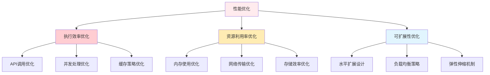

# 性能优化建议

> 系统化性能优化策略，提升 AI 评测框架的执行效率和资源利用率

## 🎯 性能优化框架

### 优化目标层次



### 性能指标体系

| 指标类别 | 具体指标 | 目标值 | 监控频率 |
|----------|----------|--------|----------|
| **执行效率** | 平均响应时间 | < 3秒 | 实时 |
| | 吞吐量（用例/分钟） | > 20 | 批次级 |
| | 成功率 | > 95% | 实时 |
| **资源使用** | 内存占用 | < 512MB | 实时 |
| | CPU使用率 | < 80% | 实时 |
| | 网络带宽 | < 10MB/s | 实时 |
| **可扩展性** | 并发处理能力 | > 50线程 | 压力测试 |
| | 负载均衡效果 | 分布均匀 | 监控 |

## 🔧 核心优化技术

### 1. API 调用优化

#### 智能批处理策略

```python
class SmartBatchProcessor:
    """智能批处理器"""
    
    def __init__(self, max_batch_size=10, min_batch_size=3):
        self.max_batch_size = max_batch_size
        self.min_batch_size = min_batch_size
        self.batch_buffer = []
        self.performance_stats = {
            'total_batches': 0,
            'average_batch_size': 0,
            'total_time_saved': 0
        }
    
    def add_test_case(self, test_case):
        """添加测试用例到批处理缓冲区"""
        self.batch_buffer.append(test_case)
        
        # 检查是否达到批处理条件
        if len(self.batch_buffer) >= self.min_batch_size:
            # 基于性能预测决定是否立即处理
            if self._should_process_now():
                return self.process_batch()
        
        return None
    
    def _should_process_now(self):
        """基于性能预测决定处理时机"""
        
        # 考虑因素：缓冲区大小、API延迟预测、资源状况
        buffer_size = len(self.batch_buffer)
        
        # 缓冲区已满，必须处理
        if buffer_size >= self.max_batch_size:
            return True
        
        # 基于历史性能预测
        expected_delay = self._predict_api_delay(buffer_size)
        
        # 如果预期延迟较低，可以等待更多用例
        if expected_delay < 2.0 and buffer_size < self.max_batch_size:
            return False
        
        return True
    
    def _predict_api_delay(self, batch_size):
        """预测API延迟"""
        # 基于历史数据的简单预测模型
        base_delay = 1.5  # 基础延迟
        size_factor = batch_size * 0.1  # 每增加一个用例增加0.1秒
        return base_delay + size_factor
    
    def process_batch(self):
        """处理当前批次"""
        if not self.batch_buffer:
            return None
        
        batch = self.batch_buffer.copy()
        self.batch_buffer.clear()
        
        # 记录性能统计
        self.performance_stats['total_batches'] += 1
        batch_sizes = self.performance_stats.get('batch_sizes', [])
        batch_sizes.append(len(batch))
        self.performance_stats['batch_sizes'] = batch_sizes
        self.performance_stats['average_batch_size'] = sum(batch_sizes) / len(batch_sizes)
        
        # 计算时间节省（相比逐个处理）
        individual_time = len(batch) * 2.0  # 假设单个处理2秒
        batch_time = self._predict_api_delay(len(batch))
        time_saved = individual_time - batch_time
        self.performance_stats['total_time_saved'] += time_saved
        
        return batch
```

#### 动态速率限制

```python
class DynamicRateLimiter:
    """动态速率限制器"""
    
    def __init__(self, initial_rpm=60, adaptive=True):
        self.current_rpm = initial_rpm
        self.adaptive = adaptive
        self.performance_history = []
        self.error_count = 0
        self.success_count = 0
    
    def get_wait_time(self):
        """获取等待时间"""
        # 计算每个请求的最小间隔（秒）
        interval = 60.0 / self.current_rpm
        return interval
    
    def record_success(self, response_time):
        """记录成功请求"""
        self.success_count += 1
        self.performance_history.append({
            'timestamp': time.time(),
            'response_time': response_time,
            'success': True
        })
        
        # 自适应调整速率
        if self.adaptive and self._should_increase_rate():
            self.current_rpm = min(self.current_rpm + 5, 120)  # 最大120 RPM
    
    def record_error(self, error_type):
        """记录错误请求"""
        self.error_count += 1
        self.performance_history.append({
            'timestamp': time.time(),
            'error_type': error_type,
            'success': False
        })
        
        # 错误时降低速率
        if self.adaptive:
            self.current_rpm = max(self.current_rpm - 10, 10)  # 最小10 RPM
    
    def _should_increase_rate(self):
        """判断是否应该提高速率"""
        
        # 检查最近10个请求的成功率
        recent_requests = self.performance_history[-10:] if len(self.performance_history) >= 10 else self.performance_history
        
        if not recent_requests:
            return False
        
        success_rate = sum(1 for r in recent_requests if r.get('success', False)) / len(recent_requests)
        
        # 成功率高于95%且响应时间稳定
        if success_rate > 0.95:
            # 检查响应时间稳定性
            response_times = [r['response_time'] for r in recent_requests if 'response_time' in r]
            if response_times:
                avg_time = sum(response_times) / len(response_times)
                std_dev = (sum((t - avg_time) ** 2 for t in response_times) / len(response_times)) ** 0.5
                
                # 响应时间标准差小于平均值的20%
                if std_dev < avg_time * 0.2:
                    return True
        
        return False
```

### 2. 并发处理优化

#### 智能线程池管理

```python
class SmartThreadPool:
    """智能线程池管理器"""
    
    def __init__(self, min_workers=2, max_workers=20, monitor_interval=30):
        self.min_workers = min_workers
        self.max_workers = max_workers
        self.current_workers = min_workers
        self.monitor_interval = monitor_interval
        
        self.performance_metrics = {
            'active_tasks': 0,
            'completed_tasks': 0,
            'average_task_time': 0,
            'queue_length': 0
        }
        
        self.thread_pool = ThreadPoolExecutor(max_workers=self.current_workers)
        self._start_monitoring()
    
    def _start_monitoring(self):
        """启动性能监控"""
        def monitor_loop():
            while True:
                self._adjust_pool_size()
                time.sleep(self.monitor_interval)
        
        monitor_thread = threading.Thread(target=monitor_loop, daemon=True)
        monitor_thread.start()
    
    def _adjust_pool_size(self):
        """动态调整线程池大小"""
        
        # 基于队列长度调整
        queue_ratio = self.performance_metrics['queue_length'] / max(1, self.performance_metrics['completed_tasks'])
        
        if queue_ratio > 0.5 and self.current_workers < self.max_workers:
            # 队列积压，增加工作线程
            new_size = min(self.current_workers + 2, self.max_workers)
            self._resize_pool(new_size)
        elif queue_ratio < 0.1 and self.current_workers > self.min_workers:
            # 队列空闲，减少工作线程
            new_size = max(self.current_workers - 1, self.min_workers)
            self._resize_pool(new_size)
    
    def _resize_pool(self, new_size):
        """调整线程池大小"""
        if new_size != self.current_workers:
            print(f"🔄 调整线程池大小: {self.current_workers} -> {new_size}")
            
            # 创建新的线程池
            old_pool = self.thread_pool
            self.thread_pool = ThreadPoolExecutor(max_workers=new_size)
            self.current_workers = new_size
            
            # 优雅关闭旧线程池
            old_pool.shutdown(wait=False)
    
    def submit_task(self, task_func, *args, **kwargs):
        """提交任务"""
        self.performance_metrics['queue_length'] += 1
        
        future = self.thread_pool.submit(self._wrap_task, task_func, *args, **kwargs)
        
        # 添加回调记录性能
        future.add_done_callback(self._task_completed)
        
        return future
    
    def _wrap_task(self, task_func, *args, **kwargs):
        """包装任务函数"""
        start_time = time.time()
        
        try:
            result = task_func(*args, **kwargs)
            return result
        finally:
            task_time = time.time() - start_time
            
            # 更新平均任务时间
            total_time = self.performance_metrics['average_task_time'] * self.performance_metrics['completed_tasks']
            self.performance_metrics['completed_tasks'] += 1
            self.performance_metrics['average_task_time'] = (total_time + task_time) / self.performance_metrics['completed_tasks']
    
    def _task_completed(self, future):
        """任务完成回调"""
        self.performance_metrics['queue_length'] = max(0, self.performance_metrics['queue_length'] - 1)
        self.performance_metrics['active_tasks'] = max(0, self.performance_metrics['active_tasks'] - 1)
```

#### 连接池优化

```python
class ConnectionPoolManager:
    """连接池管理器"""
    
    def __init__(self, max_connections=50, idle_timeout=300):
        self.max_connections = max_connections
        self.idle_timeout = idle_timeout
        
        self.connections = {}
        self.connection_stats = {
            'total_created': 0,
            'total_reused': 0,
            'active_connections': 0,
            'idle_connections': 0
        }
        self._cleanup_thread = None
        self._start_cleanup()
    
    def get_connection(self, endpoint):
        """获取连接"""
        
        # 检查是否有可重用的连接
        if endpoint in self.connections:
            conn_info = self.connections[endpoint]
            
            # 检查连接是否仍然有效
            if self._is_connection_valid(conn_info['connection']):
                self.connection_stats['total_reused'] += 1
                conn_info['last_used'] = time.time()
                conn_info['usage_count'] += 1
                return conn_info['connection']
            else:
                # 无效连接，移除
                del self.connections[endpoint]
        
        # 创建新连接
        new_conn = self._create_connection(endpoint)
        
        self.connections[endpoint] = {
            'connection': new_conn,
            'created_at': time.time(),
            'last_used': time.time(),
            'usage_count': 1
        }
        
        self.connection_stats['total_created'] += 1
        self.connection_stats['active_connections'] += 1
        
        return new_conn
    
    def release_connection(self, endpoint, connection):
        """释放连接"""
        if endpoint in self.connections:
            conn_info = self.connections[endpoint]
            
            # 标记为空闲
            self.connection_stats['active_connections'] -= 1
            self.connection_stats['idle_connections'] += 1
            
            conn_info['last_used'] = time.time()
    
    def _start_cleanup(self):
        """启动连接清理线程"""
        def cleanup_loop():
            while True:
                self._cleanup_idle_connections()
                time.sleep(60)  # 每分钟检查一次
        
        self._cleanup_thread = threading.Thread(target=cleanup_loop, daemon=True)
        self._cleanup_thread.start()
    
    def _cleanup_idle_connections(self):
        """清理空闲连接"""
        current_time = time.time()
        endpoints_to_remove = []
        
        for endpoint, conn_info in self.connections.items():
            idle_time = current_time - conn_info['last_used']
            
            if idle_time > self.idle_timeout:
                # 关闭连接
                self._close_connection(conn_info['connection'])
                endpoints_to_remove.append(endpoint)
                
                self.connection_stats['idle_connections'] -= 1
        
        # 移除超时连接
        for endpoint in endpoints_to_remove:
            del self.connections[endpoint]
```

### 3. 缓存策略优化

#### 多级缓存架构

```python
class MultiLevelCache:
    """多级缓存管理器"""
    
    def __init__(self):
        # L1: 内存缓存（快速但容量小）
        self.l1_cache = {}
        self.l1_max_size = 1000
        self.l1_ttl = 300  # 5分钟
        
        # L2: 磁盘缓存（较慢但容量大）
        self.l2_cache_dir = 'cache/l2'
        self.l2_ttl = 3600  # 1小时
        
        # L3: 分布式缓存（外部服务）
        self.l3_enabled = False
        self.l3_ttl = 86400  # 24小时
        
        self.cache_stats = {
            'l1_hits': 0,
            'l1_misses': 0,
            'l2_hits': 0,
            'l2_misses': 0,
            'l3_hits': 0,
            'l3_misses': 0
        }
    
    def get(self, key):
        """获取缓存值"""
        
        # L1 缓存查找
        if key in self.l1_cache:
            item = self.l1_cache[key]
            if time.time() - item['timestamp'] < self.l1_ttl:
                self.cache_stats['l1_hits'] += 1
                return item['value']
            else:
                # L1 缓存过期
                del self.l1_cache[key]
        
        self.cache_stats['l1_misses'] += 1
        
        # L2 缓存查找
        l2_value = self._get_l2_cache(key)
        if l2_value is not None:
            # 回写到 L1 缓存
            self._set_l1_cache(key, l2_value)
            self.cache_stats['l2_hits'] += 1
            return l2_value
        
        self.cache_stats['l2_misses'] += 1
        
        # L3 缓存查找（如果启用）
        if self.l3_enabled:
            l3_value = self._get_l3_cache(key)
            if l3_value is not None:
                # 回写到 L2 和 L1 缓存
                self._set_l2_cache(key, l3_value)
                self._set_l1_cache(key, l3_value)
                self.cache_stats['l3_hits'] += 1
                return l3_value
            
            self.cache_stats['l3_misses'] += 1
        
        return None
    
    def set(self, key, value, level='l1'):
        """设置缓存值"""
        
        if level == 'l1' or level == 'all':
            self._set_l1_cache(key, value)
        
        if level == 'l2' or level == 'all':
            self._set_l2_cache(key, value)
        
        if (level == 'l3' or level == 'all') and self.l3_enabled:
            self._set_l3_cache(key, value)
    
    def _set_l1_cache(self, key, value):
        """设置 L1 缓存"""
        # 检查缓存大小，如果超过限制则清理
        if len(self.l1_cache) >= self.l1_max_size:
            self._evict_l1_cache()
        
        self.l1_cache[key] = {
            'value': value,
            'timestamp': time.time(),
            'access_count': 0
        }
    
    def _evict_l1_cache(self):
        """L1 缓存淘汰策略"""
        # LRU（最近最少使用）淘汰策略
        lru_key = None
        lru_time = float('inf')
        
        for key, item in self.l1_cache.items():
            if item['timestamp'] < lru_time:
                lru_time = item['timestamp']
                lru_key = key
        
        if lru_key:
            del self.l1_cache[lru_key]
```

#### 预测性缓存预热

```python
class PredictiveCacheWarmer:
    """预测性缓存预热器"""
    
    def __init__(self, cache_manager, access_pattern_analyzer):
        self.cache_manager = cache_manager
        self.pattern_analyzer = access_pattern_analyzer
        self.warming_queue = []
    
    def analyze_access_patterns(self):
        """分析访问模式"""
        
        patterns = self.pattern_analyzer.get_patterns()
        
        # 识别高频访问的数据
        high_frequency_data = patterns.get('high_frequency', [])
        
        # 识别时序相关的数据
        time_correlated_data = patterns.get('time_correlated', [])
        
        # 识别关联访问的数据
        correlated_data = patterns.get('correlated', [])
        
        return {
            'high_frequency': high_frequency_data,
            'time_correlated': time_correlated_data,
            'correlated': correlated_data
        }
    
    def schedule_warming(self, patterns):
        """安排缓存预热"""
        
        # 高频数据立即预热
        for data_key in patterns['high_frequency']:
            self.warming_queue.append({
                'key': data_key,
                'priority': 'high',
                'scheduled_time': time.time()
            })
        
        # 时序相关数据按时间预热
        for data_item in patterns['time_correlated']:
            scheduled_time = self._calculate_optimal_warming_time(data_item)
            self.warming_queue.append({
                'key': data_item['key'],
                'priority': 'medium',
                'scheduled_time': scheduled_time
            })
    
    def execute_warming(self):
        """执行缓存预热"""
        
        current_time = time.time()
        
        # 按优先级和执行时间排序
        ready_items = [
            item for item in self.warming_queue 
            if item['scheduled_time'] <= current_time
        ]
        
        ready_items.sort(key=lambda x: ('high', 'medium', 'low').index(x['priority']))
        
        # 执行预热（限制并发数量）
        for item in ready_items[:10]:  # 每次最多预热10个
            self._warm_cache(item['key'])
            self.warming_queue.remove(item)
    
    def _warm_cache(self, key):
        """预热单个缓存项"""
        try:
            # 获取数据（这会触发缓存）
            data = self._fetch_data(key)
            
            # 主动设置到缓存
            self.cache_manager.set(key, data, level='all')
            
            print(f"🔥 预热缓存: {key}")
            
        except Exception as e:
            print(f"❌ 缓存预热失败 {key}: {e}")
```

## 📊 性能监控和分析

### 1. 实时性能监控

```python
class PerformanceMonitor:
    """性能监控器"""
    
    def __init__(self, alert_thresholds=None):
        self.alert_thresholds = alert_thresholds or {
            'response_time': 5.0,  # 秒
            'error_rate': 0.05,    # 5%
            'memory_usage': 0.8,   # 80%
            'cpu_usage': 0.8       # 80%
        }
        
        self.metrics = {
            'response_times': [],
            'error_counts': 0,
            'success_counts': 0,
            'memory_usage': [],
            'cpu_usage': []
        }
        
        self.alerts = []
        self._start_monitoring()
    
    def _start_monitoring(self):
        """启动监控"""
        def monitoring_loop():
            while True:
                self._collect_system_metrics()
                self._check_alerts()
                time.sleep(10)  # 每10秒收集一次
        
        monitor_thread = threading.Thread(target=monitoring_loop, daemon=True)
        monitor_thread.start()
    
    def record_api_call(self, response_time, success=True):
        """记录API调用"""
        self.metrics['response_times'].append(response_time)
        
        if success:
            self.metrics['success_counts'] += 1
        else:
            self.metrics['error_counts'] += 1
        
        # 保持最近1000个数据点
        if len(self.metrics['response_times']) > 1000:
            self.metrics['response_times'] = self.metrics['response_times'][-1000:]
    
    def _collect_system_metrics(self):
        """收集系统指标"""
        try:
            # 内存使用率
            memory_info = psutil.virtual_memory()
            self.metrics['memory_usage'].append(memory_info.percent / 100)
            
            # CPU使用率
            cpu_percent = psutil.cpu_percent(interval=1)
            self.metrics['cpu_usage'].append(cpu_percent / 100)
            
            # 保持最近100个数据点
            for key in ['memory_usage', 'cpu_usage']:
                if len(self.metrics[key]) > 100:
                    self.metrics[key] = self.metrics[key][-100:]
                    
        except Exception as e:
            print(f"❌ 系统指标收集失败: {e}")
    
    def _check_alerts(self):
        """检查告警条件"""
        
        # 检查响应时间
        if self.metrics['response_times']:
            avg_response_time = sum(self.metrics['response_times']) / len(self.metrics['response_times'])
            if avg_response_time > self.alert_thresholds['response_time']:
                self._trigger_alert('high_response_time', f"平均响应时间过高: {avg_response_time:.2f}s")
        
        # 检查错误率
        total_calls = self.metrics['success_counts'] + self.metrics['error_counts']
        if total_calls > 0:
            error_rate = self.metrics['error_counts'] / total_calls
            if error_rate > self.alert_thresholds['error_rate']:
                self._trigger_alert('high_error_rate', f"错误率过高: {error_rate:.2%}")
        
        # 检查内存使用
        if self.metrics['memory_usage']:
            avg_memory = sum(self.metrics['memory_usage']) / len(self.metrics['memory_usage'])
            if avg_memory > self.alert_thresholds['memory_usage']:
                self._trigger_alert('high_memory_usage', f"内存使用率过高: {avg_memory:.2%}")
    
    def _trigger_alert(self, alert_type, message):
        """触发告警"""
        alert = {
            'type': alert_type,
            'message': message,
            'timestamp': datetime.now().isoformat(),
            'severity': 'warning'
        }
        
        self.alerts.append(alert)
        print(f"🚨 性能告警: {message}")
```

### 2. 性能分析报告

```python
def generate_performance_report(monitor, duration_hours=24):
    """生成性能分析报告"""
    
    report = {
        'summary': {},
        'detailed_analysis': {},
        'recommendations': [],
        'alerts': monitor.alerts[-10:]  # 最近10个告警
    }
    
    # 计算关键指标
    total_calls = monitor.metrics['success_counts'] + monitor.metrics['error_counts']
    
    if total_calls > 0:
        report['summary'] = {
            'total_calls': total_calls,
            'success_rate': monitor.metrics['success_counts'] / total_calls,
            'average_response_time': sum(monitor.metrics['response_times']) / len(monitor.metrics['response_times']) if monitor.metrics['response_times'] else 0,
            'error_rate': monitor.metrics['error_counts'] / total_calls
        }
    
    # 详细分析
    report['detailed_analysis'] = {
        'response_time_distribution': analyze_response_time_distribution(monitor.metrics['response_times']),
        'error_patterns': analyze_error_patterns(monitor.metrics),
        'resource_utilization': analyze_resource_utilization(monitor.metrics)
    }
    
    # 生成优化建议
    report['recommendations'] = generate_optimization_recommendations(report['summary'], report['detailed_analysis'])
    
    return report

def generate_optimization_recommendations(summary, analysis):
    """生成优化建议"""
    
    recommendations = []
    
    # 基于响应时间的建议
    if summary.get('average_response_time', 0) > 3.0:
        recommendations.append({
            'type': 'response_time',
            'priority': 'high',
            'suggestion': '优化API调用批处理策略，减少网络往返',
            'expected_improvement': '响应时间降低30-50%'
        })
    
    # 基于错误率的建议
    if summary.get('error_rate', 0) > 0.05:
        recommendations.append({
            'type': 'error_handling',
            'priority': 'high',
            'suggestion': '实现智能重试机制和错误回退策略',
            'expected_improvement': '错误率降低到2%以下'
        })
    
    # 基于资源使用的建议
    resource_analysis = analysis.get('resource_utilization', {})
    if resource_analysis.get('memory_peak', 0) > 0.8:
        recommendations.append({
            'type': 'memory_optimization',
            'priority': 'medium',
            'suggestion': '实现内存缓存淘汰策略和对象池',
            'expected_improvement': '内存使用峰值降低20-30%'
        })
    
    return recommendations
```

## 🚀 优化实施路线图

### 短期优化（1-2周）

1. **API调用优化**
   - 实现智能批处理
   - 配置动态速率限制
   - 优化重试策略

2. **基础缓存策略**
   - 实现L1内存缓存
   - 配置合理的TTL
   - 基础缓存监控

### 中期优化（1-2月）

1. **并发处理优化**
   - 智能线程池管理
   - 连接池优化
   - 负载均衡策略

2. **高级缓存策略**
   - 多级缓存架构
   - 预测性缓存预热
   - 缓存一致性保障

### 长期优化（3-6月）

1. **系统架构优化**
   - 微服务化改造
   - 水平扩展设计
   - 弹性伸缩机制

2. **智能化优化**
   - 机器学习驱动的优化
   - 自适应参数调整
   - 预测性资源分配

## 📚 相关文档

- [Bad Case 分析方法论](Bad Case分析方法论.md)
- [中断恢复操作指南](中断恢复操作指南.md)
- [评测管线实现详解](../02-技术实现/评测管线实现详解.md)

---

**核心价值**：性能优化建议提供了从基础优化到高级架构的完整路线图，帮助系统在保证质量的前提下实现最大化的执行效率和资源利用率。