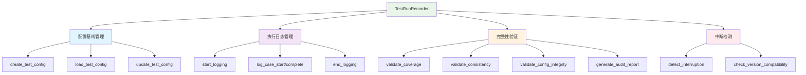

# 测试运行记录器设计

> TestRunRecorder V1.1 - 配置基线管理、线程安全日志、完整性验证与中断检测

## 🎯 设计目标

### 核心需求
- **配置基线**：记录每次测试运行的完整配置快照
- **执行日志**：线程安全地记录用例执行过程
- **完整性验证**：验证测试执行的覆盖率和一致性
- **中断检测**：支持断点续传的中断场景识别
- **质量门禁**：基于通过率阈值的自动判定

### 设计原则
1. **配置不可变**：测试配置基线一旦创建不可修改（仅可追加执行指标）
2. **线程安全**：并发执行时日志写入安全
3. **依赖注入**：支持 ConfigRegistry 可选注入
4. **审计可追溯**：生成 Markdown 格式审计报告

## 🏗️ 架构设计

### 核心组件关系



## 🔧 核心实现

源码位置：[execution.py](file:///Users/honey/Desktop/llm-testing-portfolio/scripts/tools/execution.py)

### 1. 初始化与依赖注入

```python
class TestRunRecorder:
    def __init__(self, batch_dir: str, config_registry: ConfigRegistry = None):
        self.batch_dir = batch_dir
        self.config_file = os.path.join(batch_dir, "test_config.json")
        self.log_file = os.path.join(batch_dir, "test_execution.log")
        self.config: Optional[Dict[str, Any]] = None
        self._log_lock = threading.Lock()
        self._registry = config_registry
```

| 参数 | 说明 |
|------|------|
| `batch_dir` | 批次结果目录路径 |
| `config_registry` | 配置注册中心（可选，用于获取执行参数和质量门禁） |

### 2. 配置基线管理

#### create_test_config

创建测试配置基线，记录完整的运行环境信息：

```python
def create_test_config(
    self,
    batch_id: str,
    test_case_version: str,
    test_case_file: str,
    model: str,
    evaluator_model: str,
    test_parameters: Dict[str, Any],
    api_endpoint: str = None,
    evaluator_providers: List[Dict] = None
) -> Dict[str, Any]:
```

生成的 `test_config.json` 结构：

```json
{
  "batch_id": "batch-016",
  "test_run_id": "TR-2026-04-13-016",
  "created_at": "2026-04-13T10:00:00",
  "completed_at": null,
  "status": "running",

  "test_configuration": {
    "test_case_version": "2.1",
    "test_case_file": "projects/01-ai-customer-service/cases/universal.json",
    "test_case_hash": "a1b2c3d",
    "total_cases": 0,
    "dimensions": []
  },

  "environment": {
    "model_under_test": "ernie-4.5-turbo-128k",
    "evaluator_model": "qwen-turbo",
    "api_endpoint": "https://qianfan.baidubce.com/v2/chat/completions",
    "evaluator_providers": [
      {"name": "阿里云DashScope", "model": "qwen-turbo", "base_url": "...", "priority": 1},
      {"name": "魔搭社区", "model": "Qwen/Qwen3.5-35B-A3B", "base_url": "...", "priority": 2}
    ],
    "python_version": "3.11.0",
    "os": "macOS-14.0"
  },

  "test_parameters": {
    "mode": "full",
    "concurrent": 2,
    "timeout": 300,
    "retry_attempts": 3
  },

  "execution_metrics": {
    "total_duration_seconds": 0,
    "average_time_per_case_seconds": 0.0,
    "success_rate": 0.0,
    "api_calls": 0,
    "total_tokens": 0
  },

  "quality_gates": {
    "pass_rate_threshold": 0.9,
    "actual_pass_rate": 0.0,
    "result": "PENDING"
  }
}
```

#### ConfigRegistry 集成

当注入了 `config_registry` 时，`create_test_config` 会自动从注册中心获取参数：

| 参数 | 来源 | 回退值 |
|------|------|--------|
| `timeout` | `registry.execution_config.parameters.timing.case_timeout` | 300 |
| `retry_attempts` | `registry.execution_config.parameters.retry.max_attempts` | 3 |
| `pass_rate_threshold` | `registry.quality_gate.overall_threshold` | 0.9 |

### 3. 执行日志管理

#### 线程安全日志

所有日志写入操作通过 `_log_lock` 保证线程安全：

```python
def log_case_start(self, case_id: str, index: int, total: int):
    timestamp = datetime.now().strftime("%Y-%m-%d %H:%M:%S")
    with self._log_lock:
        with open(self.log_file, 'a', encoding='utf-8') as f:
            f.write(f"[{timestamp}] INFO  [{index}/{total}] {case_id} started\n")

def log_case_complete(self, case_id: str, index: int, total: int, status: str):
    timestamp = datetime.now().strftime("%Y-%m-%d %H:%M:%S")
    with self._log_lock:
        with open(self.log_file, 'a', encoding='utf-8') as f:
            f.write(f"[{timestamp}] INFO  [{index}/{total}] {case_id} completed - {status}\n")

def log_error(self, case_id: str, error_message: str):
    timestamp = datetime.now().strftime("%Y-%m-%d %H:%M:%S")
    with self._log_lock:
        with open(self.log_file, 'a', encoding='utf-8') as f:
            f.write(f"[{timestamp}] ERROR [{case_id}] {error_message}\n")
```

#### 质量门禁判定

`end_logging()` 在日志结束时写入质量门禁判定：

```python
def end_logging(self, summary: Dict[str, Any]):
    threshold = self.config["quality_gates"]["pass_rate_threshold"] if self.config else 0.9
    if summary['pass_rate'] / 100 >= threshold:
        f.write(f"Quality gate: PASS ({summary['pass_rate']:.1f}% >= {threshold*100:.1f}%)\n")
    else:
        f.write(f"Quality gate: FAIL ({summary['pass_rate']:.1f}% < {threshold*100:.1f}%)\n")
```

### 4. 完整性验证

#### validate_coverage

验证用例覆盖率（实际完成数/预期总数）：

```python
def validate_coverage(self, expected_total: int, actual_completed: int) -> Dict[str, Any]:
    coverage = actual_completed / expected_total if expected_total > 0 else 0
    return {
        "name": "用例覆盖率",
        "expected": "100%",
        "actual": f"{coverage*100:.1f}%",
        "passed": coverage == 1.0
    }
```

#### validate_consistency

验证结果一致性（执行记录数与评测结果数是否相等）：

```python
def validate_consistency(self, records_count: int, results_count: int) -> Dict[str, Any]:
    return {
        "name": "结果一致性",
        "expected": records_count,
        "actual": results_count,
        "passed": records_count == results_count
    }
```

#### validate_config_integrity

验证配置基线完整性（检查嵌套字段是否缺失）：

```python
def validate_config_integrity(self) -> Dict[str, Any]:
    required_fields = [
        "test_configuration.test_case_version",
        "test_configuration.test_case_file",
        "environment.model_under_test",
        "environment.evaluator_model"
    ]
    return {
        "name": "配置基线完整性",
        "expected": "无缺失字段",
        "actual": f"缺失 {len(missing_fields)} 个字段" if missing_fields else "无缺失字段",
        "passed": len(missing_fields) == 0,
        "missing_fields": missing_fields
    }
```

### 5. 审计报告

#### generate_audit_report

生成 **Markdown 格式**的审计报告（不是JSON）：

```python
def generate_audit_report(self, validation_results: List[Dict[str, Any]]) -> str:
    report = f"""# 测试执行审计报告

## 批次信息
- 批次ID: {self.config['batch_id']}
- 测试运行ID: {self.config['test_run_id']}
- 执行时间: {self.config['created_at']} ~ {self.config.get('completed_at', 'N/A')}

## 完整性检查
| 检查项 | 期望值 | 实际值 | 状态 |
|--------|--------|--------|------|
"""
    for result in validation_results:
        status = "✅ PASS" if result["passed"] else "❌ FAIL"
        report += f"| {result['name']} | {result['expected']} | {result['actual']} | {status} |\n"
    return report
```

#### save_audit_report

保存审计报告为 `audit_report.md`：

```python
def save_audit_report(self, report: str):
    report_file = os.path.join(self.batch_dir, "audit_report.md")
    with open(report_file, 'w', encoding='utf-8') as f:
        f.write(report)
```

### 6. 中断检测

#### detect_interruption

检测批次是否因中断而未完成，用于断点续传：

```python
def detect_interruption(self) -> Dict[str, Any]:
    if self.config["status"] == "completed":
        return {"detected": False, "reason": "Batch already completed"}

    last_completed = self.get_last_completed_case()
    total = self.config["test_configuration"]["total_cases"]

    if last_completed is None:
        return {"detected": True, "completed": 0, "total": total, "last_completed": None}

    completed_count = sum(1 for line in open(self.log_file) if "completed" in line)
    return {
        "detected": completed_count < total,
        "completed": completed_count,
        "total": total,
        "last_completed": last_completed,
        "last_timestamp": last_timestamp
    }
```

#### check_version_compatibility

检查当前用例版本与批次配置中的版本是否一致：

```python
def check_version_compatibility(self, current_case_version: str) -> Dict[str, Any]:
    batch_version = self.config["test_configuration"]["test_case_version"]
    return {
        "compatible": batch_version == current_case_version,
        "batch_version": batch_version,
        "current_version": current_case_version
    }
```

## 📁 批次目录文件结构

每次测试运行会在 `results/` 下创建一个批次目录：

```
results/batch-016_2026-04-13/
├── test_config.json        # 配置基线
├── test_execution.log      # 执行日志
├── records.json            # 执行记录
├── results.json            # 评测结果
├── audit_report.md         # 审计报告
├── bug_list.md             # Bug清单
├── bug_list.json           # Bug清单(JSON)
├── bypass_stats_report.md  # 绕过成功率统计
├── security_report.md      # 安全专项报告
├── evaluation_detail.csv   # 评测明细CSV
└── evaluation_summary.csv  # 统计汇总CSV
```

## 📚 相关技术文档

- [配置注册中心设计](配置注册中心设计.md)
- [三文件分离架构详解](../01-架构设计/三文件分离架构详解.md)
- [中断恢复操作指南](../04-最佳实践/中断恢复操作指南.md)

---

**核心价值**：TestRunRecorder V1.1 通过配置基线管理、线程安全日志、完整性验证和质量门禁，为测试执行提供了完整的可追溯性和可靠性保障，支持中断检测实现断点续传。
