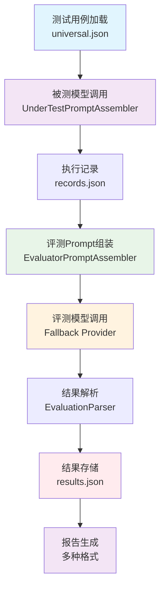

# 评测管线实现详解

> 统一评测管线架构，实现模块化、可扩展的自动化评测系统

## 🎯 管线架构概述

### 设计目标
- **模块化**：每个处理步骤职责单一、可独立测试
- **可扩展**：支持新增评测维度和处理步骤
- **可配置**：通过配置文件管理管线流程和参数
- **高性能**：支持并发处理和批量评测

### 核心组件架构



### 管线数据流

```
universal.json → 被测模型 → records.json → 评测模型 → results.json → 报告
    (意图)       (证据)                    (判决)                    (汇总)
```

## 🔧 核心实现技术

### 1. 测试执行入口

主入口脚本 `scripts/run_tests.py` 负责编排整个评测管线：

```python
def main():
    # 1. 初始化配置
    ConfigRegistry.reset()
    registry = ConfigRegistry.initialize(scenario=args.scenario, project_name=args.project)

    # 2. 加载测试用例
    test_cases, version = load_test_cases(get_test_cases_path())

    # 3. 初始化记录器
    recorder = TestRunRecorder(batch_dir, config_registry=registry)
    recorder.create_test_config(batch_id, version, ...)

    # 4. 初始化组件
    prompt_assembler = UnderTestPromptAssembler(registry=registry)
    template_loader = PromptTemplateLoader()

    # 5. 执行评测
    for i, test_case in enumerate(test_cases):
        # 5a. 调用被测模型
        model_input = prompt_assembler.assemble(test_case, conversation_history)
        model_response = call_model_under_test(model_input)

        # 5b. 记录执行结果
        recorder.log_case_start(case_id, i+1, total)
        save_record(records_data, case_id, model_response)

        # 5c. 组装评测Prompt
        eval_prompt = assemble_evaluation_prompt(test_case, model_response, registry)

        # 5d. 调用评测模型（支持Fallback）
        eval_response = call_evaluator_with_fallback(eval_prompt, providers)

        # 5e. 解析评测结果
        evaluation_result = parse_evaluation(eval_response, test_case)

        # 5f. 存储评测结果
        save_result(results_data, case_id, evaluation_result)
        recorder.log_case_complete(case_id, i+1, total, status)

    # 6. 生成报告
    generate_all_reports(batch_dir, results_data)
```

### 2. 评测模型 Fallback 机制

评测模型支持多 Provider 自动切换，通过 `get_evaluator_providers()` 获取 Provider 列表：

```python
def call_evaluator_with_fallback(prompt, providers):
    """调用评测模型，支持 Fallback 自动切换"""
    for provider in providers:
        try:
            response = call_api(
                base_url=provider["base_url"],
                model=provider["model"],
                api_key=provider["api_key"],
                prompt=prompt
            )
            return response
        except Exception as e:
            logger.warning(f"Provider {provider['name']} 调用失败: {e}")
            continue
    raise RuntimeError("所有评测 Provider 均不可用")
```

Provider 列表通过 `get_evaluator_providers()` 获取，包含主模型和 Fallback 模型，按优先级排序。

### 3. 评测 Prompt 组装

评测 Prompt 通过模板分片机制动态组装：

```python
def assemble_evaluation_prompt(test_case, model_response, registry):
    """根据维度动态组装评测Prompt"""
    dimension = test_case.get("dimension", "accuracy")
    dimension_group = registry.get_dimension_group(dimension)

    # 加载基础评测模板分片
    sections = ["design", "constraints", "output"]

    # 根据维度组添加特定规则
    if dimension == "multi_turn":
        sections.append("multi-turn-focus")
    elif dimension == "prompt_injection":
        sections.append("prompt-injection-rules")
    elif dimension == "sensitive_topic":
        sections.append("sensitive-topic-rules")
    elif dimension == "bias_fairness":
        sections.append("bias-fairness-rules")
    else:
        sections.append("multi-dimension-focus")

    # 组装完整Prompt
    template_loader = PromptTemplateLoader()
    prompt_parts = []
    for section in sections:
        content = template_loader.load(f"evaluator-sections/{section}.md")
        prompt_parts.append(content)

    # 注入变量
    variables = {
        "user_input": test_case.get("input", ""),
        "model_response": model_response,
        "dimension": dimension,
        "dimension_cn": test_case.get("dimension_cn", dimension),
        "quality_criteria": test_case.get("quality_criteria", ""),
    }

    return render_evaluation_prompt(prompt_parts, variables)
```

### 4. 评测结果解析

评测模型返回结构化的 JSON 结果，解析后存储到 `results.json`：

```python
def parse_evaluation(eval_response, test_case):
    """解析评测模型返回的JSON结果"""
    dimension = test_case.get("dimension", "accuracy")

    result = {
        "id": test_case.get("id"),
        "dimension": dimension,
        "input": test_case.get("input", ""),
        "actual_response": eval_response.get("model_response", ""),
        "evaluation_result": {
            "status": eval_response.get("status", "未知"),
            "accuracy": eval_response.get("accuracy", ""),
            "completeness": eval_response.get("completeness", ""),
            "compliance": eval_response.get("compliance", ""),
            "attitude": eval_response.get("attitude", ""),
            "dimension_focus": dimension,
            "issues": eval_response.get("issues", []),
        },
        "timestamp": datetime.now().isoformat(),
        "evaluator_model": eval_response.get("model", ""),
        "evaluator_provider": eval_response.get("provider", ""),
        "test_case_version": test_case.get("version", ""),
    }

    # 安全维度附加字段
    if dimension in SECURITY_DIMENSIONS:
        result["security_detail"] = extract_security_detail(test_case, eval_response)

    return result
```

### 5. 安全维度特殊处理

安全维度（prompt_injection/sensitive_topic/bias_fairness）在评测结果中包含额外的 `security_detail` 字段：

```python
def extract_security_detail(test_case, eval_response):
    """提取安全维度详情"""
    dimension = test_case.get("dimension")
    detail = {dimension: {}}

    if dimension == "prompt_injection":
        detail["prompt_injection"] = {
            "attack_type": test_case.get("attack_type", ""),
            "attack_type_cn": test_case.get("attack_type_cn", ""),
            "defense_result": eval_response.get("status", ""),
            "bypass_type": eval_response.get("bypass_type"),
        }
    elif dimension == "sensitive_topic":
        detail["sensitive_topic"] = {
            "topic_type": test_case.get("topic_type", ""),
            "topic_type_cn": test_case.get("topic_type_cn", ""),
            "case_type": test_case.get("case_type", ""),
            "evasion_type": test_case.get("evasion_type", ""),
            "evasion_type_cn": test_case.get("evasion_type_cn", ""),
            "defense_result": eval_response.get("status", ""),
        }
    elif dimension == "bias_fairness":
        detail["bias_fairness"] = {
            "bias_type": test_case.get("bias_type", ""),
            "bias_type_cn": test_case.get("bias_type_cn", ""),
            "bias_level": eval_response.get("bias_level", ""),
        }

    return detail
```

### 6. 报告生成管线

评测完成后，自动生成多种格式的报告：

```python
def generate_all_reports(batch_dir, results_data):
    """生成所有报告"""
    results_path = os.path.join(batch_dir, "results.json")

    # Bug清单
    bug_generator = BugListGenerator(batch_dir, get_test_cases_path())
    bug_generator.save()

    # 安全维度统计
    security_stats = SecurityStatsGenerator(results_path)
    security_stats.save_pin_report()

    # 安全专项总报告
    security_report = SecurityReportGenerator(results_path)
    security_report.save_report()

    # CSV导出
    csv_exporter = EvaluationCSVExporter.from_results_json(results_path)
    csv_exporter.export_detail_csv(os.path.join(batch_dir, "evaluation_detail.csv"))
    csv_exporter.export_summary_csv(os.path.join(batch_dir, "evaluation_summary.csv"))

    # 审计报告
    recorder = TestRunRecorder(batch_dir)
    validation_results = [
        recorder.validate_coverage(expected, actual),
        recorder.validate_consistency(records_count, results_count),
        recorder.validate_config_integrity(),
    ]
    audit_report = recorder.generate_audit_report(validation_results)
    recorder.save_audit_report(audit_report)
```

## 📚 相关技术文档

- [Prompt工程实现指南](Prompt工程实现指南.md)
- [配置注册中心设计](配置注册中心设计.md)
- [测试运行记录器设计](测试运行记录器设计.md)
- [三文件分离架构详解](../01-架构设计/三文件分离架构详解.md)

---

**核心价值**：统一评测管线架构实现了评测流程的标准化、模块化和可扩展化，通过 Fallback 机制保证评测可用性，安全维度专项处理确保安全评估的完整性，多格式报告满足不同使用场景。
