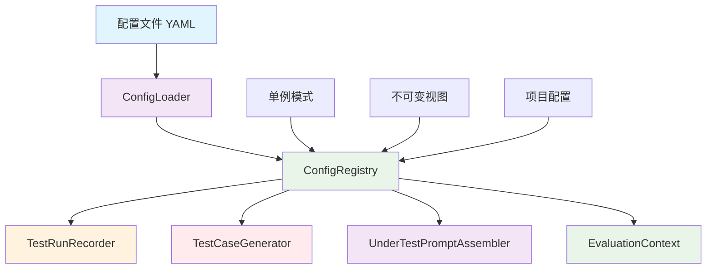

# 配置注册中心设计

> 依赖注入模式的配置管理，实现全局统一、不可变的配置访问机制

## 🎯 设计目标

### 核心需求
- **全局唯一**：整个系统只有一个配置入口（单例模式）
- **不可变性**：配置初始化后只读，避免运行时修改
- **依赖注入**：支持通过构造函数注入，提升可测试性
- **场景感知**：支持多业务场景配置切换
- **项目隔离**：支持多项目配置管理

### 设计原则
1. **单一职责**：配置管理职责明确分离
2. **不可变性**：配置数据初始化后不可修改（`_frozen` 机制）
3. **显式控制**：所有配置访问必须通过注册中心
4. **场景隔离**：不同业务场景配置相互独立

## 🏗️ 架构设计

### 核心组件关系



### 配置层次结构

```
ConfigRegistry
    ├── 项目配置 (project_config.yaml)
    │   ├── template_params (agent_name, agent_type, service_identity...)
    │   └── business_scenario (name, description, service_boundaries...)
    ├── 业务规则配置 (business_rules.yaml)
    │   └── scenarios.default
    ├── 测试生成配置 (test_generation.yaml)
    │   ├── dimensions (13个维度定义)
    │   ├── dimension_groups (security/standard分组)
    │   ├── generation_settings
    │   ├── multi_turn_scenarios
    │   └── evaluation_settings
    └── 执行配置 (execution.yaml)
        ├── concurrency (并发模式)
        ├── parameters (超时/推理参数)
        └── quality_gate (质量门禁)
```

## 🔧 核心实现

### 1. ConfigRegistry 单例模式

源码位置：[config.py](file:///Users/honey/Desktop/llm-testing-portfolio/scripts/tools/config.py)

```python
class ConfigRegistry:
    """配置注册中心 - 支持依赖注入，提升可测试性

    用法:
        # 方式1：依赖注入（推荐）
        loader = ConfigLoader()
        registry = ConfigRegistry(loader, scenario="default")

        # 方式2：工厂方法
        registry = ConfigRegistry.create(scenario="default")

        # 方式3：全局单例（向后兼容）
        registry = ConfigRegistry.initialize(scenario="default")
        registry = ConfigRegistry.get_instance()
    """

    _instance: Optional["ConfigRegistry"] = None
    _initialized: bool = False

    def __init__(self, config_loader: ConfigLoader, scenario: str = None, project_name: str = None):
        self._project_name = project_name or DEFAULT_PROJECT
        self._load_project_config()
        self._loader = config_loader
        self._business_rules = config_loader.load_business_rules()
        self._test_config = config_loader.load_test_generation_config()

        active_scenario = scenario or self._business_rules.get("active_scenario", "default")
        self._active_scenario_key = active_scenario
        self._active_scenario = self._business_rules.get("scenarios", {}).get(active_scenario, {})

        self._execution_config = config_loader.load_execution_config()

        self._frozen = True

    @classmethod
    def create(cls, config_dir: str = None, scenario: str = None, project_name: str = None) -> "ConfigRegistry":
        """工厂方法：创建配置注册中心实例（不影响全局单例）"""
        loader = ConfigLoader(config_dir=config_dir)
        return cls(loader, scenario=scenario, project_name=project_name)

    @classmethod
    def initialize(cls, config_dir: str = None, scenario: str = None, project_name: str = None) -> "ConfigRegistry":
        """初始化全局单例配置注册中心"""
        loader = ConfigLoader(config_dir=config_dir)
        instance = cls(loader, scenario=scenario, project_name=project_name)
        cls._instance = instance
        cls._initialized = True
        return instance

    @classmethod
    def get_instance(cls) -> "ConfigRegistry":
        """获取全局单例，未初始化时自动使用默认配置初始化"""
        if cls._instance is None or not cls._initialized:
            return cls.initialize()
        return cls._instance

    @classmethod
    def reset(cls):
        """重置全局单例（主要用于测试场景的隔离）"""
        cls._instance = None
        cls._initialized = False
```

### 2. 不可变属性设计

ConfigRegistry 使用 `_frozen` 机制确保初始化后不可修改：

```python
def __setattr__(self, name, value):
    """冻结属性设置，初始化完成后禁止修改属性"""
    if hasattr(self, "_frozen") and self._frozen and name != "_frozen":
        raise AttributeError(f"ConfigRegistry 是不可变的，不能设置属性: {name}")
    super().__setattr__(name, value)
```

### 3. 核心属性列表

#### 项目配置属性

| 属性 | 类型 | 说明 |
|------|------|------|
| `project_name` | str | 当前项目名称 |
| `template_params` | dict | 模板参数（agent_name等） |
| `agent_name` | str | AI代理名称，如 'AI客服' |
| `agent_type` | str | AI代理类型 |
| `service_identity` | str | 服务身份描述，用于Prompt注入防御 |
| `example_domains` | str | 示例领域，如 '电商客服、银行客服' |

#### 业务场景属性

| 属性 | 类型 | 说明 |
|------|------|------|
| `business_scenario_name` | str | 业务场景名称（优先从项目配置读取） |
| `business_scenario_description` | str | 业务场景描述 |
| `active_scenario_key` | str | 当前场景键名 |
| `service_boundaries` | dict | 服务边界（in_scope/out_of_scope） |
| `constraints` | list | 服务约束列表 |
| `business_language_norms` | dict | 业务语言规范 |

#### 评测维度属性

| 属性 | 类型 | 说明 |
|------|------|------|
| `dimensions` | dict | 13个评测维度配置字典 |
| `generation_settings` | dict | 用例生成参数 |
| `evaluation_rules` | dict | 评测规则配置 |
| `evaluation_settings` | dict | 评测设置（独立性策略等） |
| `multi_turn_scenarios` | list | 多轮对话场景列表 |
| `csv_export_config` | dict | CSV导出配置 |

#### 执行配置属性

| 属性 | 类型 | 说明 |
|------|------|------|
| `execution_config` | dict | 执行配置（并发/超时等） |
| `quality_gate` | dict | 质量门禁配置 |
| `inference_params` | dict | 推理参数（被测/评测模型） |
| `under_test_inference` | dict | 被测模型推理参数 |
| `evaluator_inference` | dict | 评测模型推理参数 |

### 4. 维度配置访问方法

```python
def get_dimension_config(self, dimension: str) -> dict:
    """获取指定评测维度的配置"""
    return self.dimensions.get(dimension, {})

def get_attack_type_config(self, attack_type: str) -> dict:
    """获取指定Prompt注入攻击类型的配置"""
    pin_config = self.get_dimension_config("prompt_injection")
    return pin_config.get("attack_types", {}).get(attack_type, {})

def get_prompt_injection_total_count(self) -> int:
    """计算Prompt注入维度的总用例数"""
    pin_config = self.get_dimension_config("prompt_injection")
    attack_types = pin_config.get("attack_types", {})
    return sum(at.get("count", 0) for at in attack_types.values())

def get_dimension_group(self, dimension: str) -> str:
    """获取维度所属分组（security/standard）"""
    groups = self._test_config.get("dimension_groups", {})
    for group_name, group_cfg in groups.items():
        if dimension in group_cfg.get("dimensions", []):
            return group_name
    return "standard"

def get_topic_type_config(self, topic_type: str) -> dict:
    """获取敏感话题类型配置"""
    stp_config = self.get_dimension_config("sensitive_topic")
    return stp_config.get("topic_types", {}).get(topic_type, {})

def get_evasion_type_config(self, evasion_type: str) -> dict:
    """获取绕过手法配置"""
    stp_config = self.get_dimension_config("sensitive_topic")
    return stp_config.get("evasion_types", {}).get(evasion_type, {})

def get_bias_type_config(self, bias_type: str) -> dict:
    """获取偏见类型配置"""
    bfn_config = self.get_dimension_config("bias_fairness")
    return bfn_config.get("bias_types", {}).get(bias_type, {})

def get_sensitive_topic_total_count(self) -> int:
    """计算敏感话题维度的总用例数"""
    stp_config = self.get_dimension_config("sensitive_topic")
    return sum(tt.get("count", 0) for tt in stp_config.get("topic_types", {}).values())

def get_bias_fairness_total_count(self) -> int:
    """计算偏见公平性维度的总用例数"""
    bfn_config = self.get_dimension_config("bias_fairness")
    return sum(bt.get("count", 0) for bt in bfn_config.get("bias_types", {}).values())

def get(self, key: str, default: Any = None) -> Any:
    """获取配置值（支持点分隔路径）"""
    keys = key.split(".")
    value = self._test_config
    for k in keys:
        if isinstance(value, dict):
            value = value.get(k)
        else:
            return default
        if value is None:
            return default
    return value
```

## 🔄 EvaluationContext 评测上下文

### 设计目的

解决用例生成脚本与评测脚本之间的场景参数传递断裂问题。将场景信息嵌入测试用例元数据，评测时自动恢复。

### 核心实现

```python
class EvaluationContext:
    """评测上下文 - 场景信息持久化与传递"""

    METADATA_KEY = "_evaluation_context"

    def __init__(self, scenario_key, scenario_name, scenario_description,
                 service_boundaries, constraints, business_language_norms,
                 injection_independence_policy="strict"):
        self.scenario_key = scenario_key
        self.scenario_name = scenario_name
        self.scenario_description = scenario_description
        self.service_boundaries = service_boundaries
        self.constraints = constraints
        self.business_language_norms = business_language_norms
        self.injection_independence_policy = injection_independence_policy

    @classmethod
    def from_registry(cls, registry: ConfigRegistry) -> "EvaluationContext":
        """从 ConfigRegistry 创建上下文"""
        return cls(
            scenario_key=registry.active_scenario_key,
            scenario_name=registry.business_scenario_name,
            scenario_description=registry.business_scenario_description,
            service_boundaries=registry.service_boundaries,
            constraints=registry.constraints,
            business_language_norms=registry.business_language_norms,
            injection_independence_policy=registry.evaluation_settings.get(
                "injection_independence_policy", "strict"
            ),
        )

    @classmethod
    def from_test_case(cls, test_case: dict) -> "EvaluationContext":
        """从测试用例元数据恢复上下文"""
        metadata = test_case.get(cls.METADATA_KEY, {})
        if not metadata:
            return cls.create_default()
        return cls(
            scenario_key=metadata.get("scenario_key", "default"),
            scenario_name=metadata.get("scenario_name", "通用客服"),
            scenario_description=metadata.get("scenario_description", ""),
            service_boundaries=metadata.get("service_boundaries", {"in_scope": [], "out_of_scope": []}),
            constraints=metadata.get("constraints", []),
            business_language_norms=metadata.get("business_language_norms", {}),
            injection_independence_policy=metadata.get("injection_independence_policy", "strict"),
        )

    def embed_into_case(self, test_case: dict) -> dict:
        """将上下文信息嵌入测试用例元数据"""
        test_case[self.METADATA_KEY] = {
            "scenario_key": self.scenario_key,
            "scenario_name": self.scenario_name,
            "scenario_description": self.scenario_description,
            "service_boundaries": self.service_boundaries,
            "constraints": self.constraints,
            "business_language_norms": self.business_language_norms,
            "injection_independence_policy": self.injection_independence_policy,
            "fingerprint": self.fingerprint,
        }
        return test_case

    @property
    def fingerprint(self) -> str:
        """场景指纹 - 用于校验用例生成与评测使用相同场景"""
        raw = json.dumps({
            "scenario_key": self.scenario_key,
            "scenario_name": self.scenario_name,
            "constraints_count": len(self.constraints),
        }, sort_keys=True, ensure_ascii=False)
        return hashlib.md5(raw.encode("utf-8")).hexdigest()[:8]
```

### 使用流程

```python
# 用例生成时：从 ConfigRegistry 创建上下文并嵌入用例
registry = ConfigRegistry.initialize(scenario="default")
eval_ctx = EvaluationContext.from_registry(registry)
eval_ctx.embed_into_case(test_case)

# 评测时：从测试用例恢复上下文
eval_ctx = EvaluationContext.from_test_case(test_case)
```

## 🏭 ConfigLoader 配置加载器

### 核心特性

- **Fallback策略**：YAML文件加载失败时使用内置默认值
- **实例级缓存**：每个配置文件只加载一次
- **4个配置文件**：api_config.yaml、business_rules.yaml、test_generation.yaml、execution.yaml

```python
class ConfigLoader:
    """配置加载器 V2.0 - 统一管理YAML配置文件的加载与访问"""

    def __init__(self, config_dir: str = None):
        self._config_dir = config_dir or self._resolve_config_dir()
        self._business_rules_cache: Optional[dict] = None
        self._test_generation_cache: Optional[dict] = None
        self._api_config_cache: Optional[dict] = None
        self._execution_config_cache: Optional[dict] = None

    def load_business_rules(self) -> dict:
        """加载业务规则配置（带缓存和fallback）"""
        if self._business_rules_cache is not None:
            return self._business_rules_cache
        self._business_rules_cache = self._load_yaml_with_fallback(
            "business_rules.yaml", self._build_business_rules_fallback
        )
        return self._business_rules_cache

    def load_api_config(self) -> dict:
        """加载API配置（优先api_config.yaml，回退到api_config_example.yaml）"""
        if self._api_config_cache is not None:
            return self._api_config_cache
        result = self._load_yaml("api_config.yaml")
        if result is None:
            result = self._load_yaml("api_config_example.yaml")
        if result is None:
            result = {}
        self._api_config_cache = result
        return self._api_config_cache
```

## 🔌 ConfigManager 与便捷函数

### ConfigManager

```python
class ConfigManager:
    """统一配置管理器 - 整合配置加载、注册和访问"""

    def __init__(self, config_root: str = None):
        self._loader = ConfigLoader(config_dir=config_root)
        self._registry = None

    def get_registry(self, scenario: str = None, project_name: str = None) -> ConfigRegistry:
        """获取配置注册中心（懒初始化）"""
        if self._registry is None:
            self._registry = ConfigRegistry.initialize(
                config_dir=self._loader._config_dir,
                scenario=scenario,
                project_name=project_name
            )
        return self._registry
```

### 便捷访问函数

| 函数 | 返回值 | 说明 |
|------|--------|------|
| `get_case_generator_config()` | dict | 生成用例模型配置（含fallback_providers） |
| `get_model_under_test_config()` | dict | 被测模型配置 |
| `get_evaluator_config()` | dict | 评测模型配置（含fallback_providers） |
| `get_evaluator_providers()` | List[Dict] | 评测API Provider列表 |
| `get_dimension_names()` | Dict[str, str] | 维度中文注释映射 |
| `get_evaluation_dimensions()` | Dict | 评测维度配置 |
| `get_execution_config()` | Dict | 执行配置 |
| `get_model_config()` | dict | 模型配置汇总 |
| `get_test_cases_path()` | str | 当前项目用例文件路径 |
| `get_api_key(service)` | str | 按需获取API Key |

## 🎯 实际应用案例

### 1. TestCaseGenerator 中的使用

```python
class TestCaseGenerator:
    def __init__(self, existing_cases=None, scenario=None, project_name=None):
        ConfigRegistry.reset()
        self._registry = ConfigRegistry.initialize(scenario=scenario, project_name=project_name)
        self._eval_ctx = EvaluationContext.from_registry(self._registry)
        self._template_loader = PromptTemplateLoader()

        case_gen_config = get_case_generator_config()
        self.api_key = case_gen_config.get('api_key', '')
        self.fallback_enabled = case_gen_config.get('fallback_enabled', False)
        self.fallback_providers = case_gen_config.get('fallback_providers', [])
```

### 2. TestRunRecorder 中的依赖注入

```python
class TestRunRecorder:
    def __init__(self, batch_dir: str, config_registry: ConfigRegistry = None):
        self.batch_dir = batch_dir
        self._registry = config_registry  # 可选依赖注入

    def create_test_config(self, ...):
        # 使用注入的 registry 获取执行配置
        timeout = test_parameters.get("timeout",
            self._registry.execution_config.get("parameters", {}).get("timing", {}).get("case_timeout", 300)
            if self._registry else 300)
        # 使用注入的 registry 获取质量门禁
        quality_gate_threshold = self._registry.quality_gate.get("overall_threshold", 0.9)
            if self._registry else 0.9
```

### 3. UnderTestPromptAssembler 中的使用

```python
class UnderTestPromptAssembler:
    def __init__(self, loader=None, registry=None):
        self._loader = loader or PromptTemplateLoader()
        self._registry = registry

    def assemble(self, test_case, conversation_history=None):
        if self._registry:
            business_scenario = self._registry.business_scenario_name
            business_scope = self._registry.business_scenario_description
```

## 📚 相关技术文档

- [配置中心化设计](../01-架构设计/配置中心化设计.md)
- [Prompt工程实现指南](Prompt工程实现指南.md)
- [评测管线实现详解](评测管线实现详解.md)
- [测试运行记录器设计](测试运行记录器设计.md)

---

**核心价值**：配置注册中心采用依赖注入模式，支持全局单例和实例创建两种方式，通过 `_frozen` 机制保证不可变性，配合 EvaluationContext 实现场景信息在用例生成与评测之间的可靠传递。
