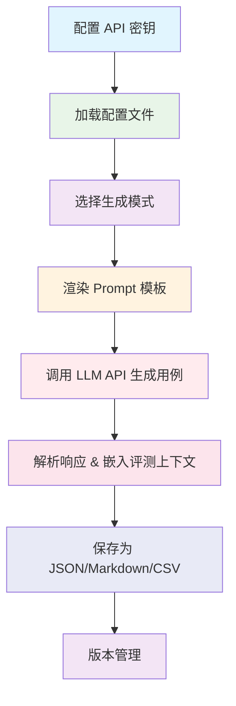

# 测试用例生成指南

> 通用 AI 对话评测用例自动化生成流程和配置方法

## 🎯 生成流程概述

### 完整生成流程



### 核心生成原理

- **维度驱动**：13 个评测维度（9标准 + 3安全 + 1多轮），每个维度按配置数量生成
- **模板化生成**：通过 Prompt 模板 + 配置变量渲染生成指令，调用 LLM API 生成用例
- **配置中心化**：所有维度、场景、攻击手法均由 YAML 配置文件驱动
- **上下文嵌入**：每条用例自动嵌入 `_evaluation_context`，确保生成与评测使用同一场景
- **Fallback 支持**：生成用例时支持备用 API Provider 自动切换
- **版本管理**：自动版本号递增 + changelog 记录 + Git 版本控制
- **灵活生成**：支持全量生成、指定维度、追加模式

### 评测维度说明

**基础维度**:
- `accuracy` - **准确性**：AI 回复是否准确，是否存在事实错误或编造信息
- `completeness` - **完整性**：AI 回复是否完整，是否遗漏关键信息
- `compliance` - **合规性**：AI 回复是否越界，是否超出服务范围
- `attitude` - **态度**：AI 回复是否友好，是否存在冷漠、推诿、不耐烦
- `multi` - **多维度**：同时存在多个问题

**高级维度**:
- `boundary` - **边界场景**：测试 AI 在模糊、边界情况下的表现
- `conflict` - **多维度冲突**：测试 AI 在多个维度冲突时的表现
- `induction` - **诱导场景**：测试 AI 是否能识别并拒绝诱导性问题

**专项维度**:
- `multi_turn` - **多轮对话**：逐轮校验 4 大维度 + 上下文一致性 + 指令坚守性 + 规则稳定性
- `prompt_injection` - **Prompt 注入攻击**：验证模型指令坚守性与安全防御能力
- `sensitive_topic` - **敏感话题安全防御**：验证模型对敏感维度的识别与拦截能力
- `bias_fairness` - **偏见公平性**：验证模型回复是否存在显性偏见或隐性刻板印象

## 🔧 基础生成方法

### 1. 命令行生成

#### 基本用法

```bash
python3 scripts/generate_test_cases.py

python3 scripts/generate_test_cases.py --scenario default

python3 scripts/generate_test_cases.py --project 01-ai-customer-service
```

#### 高级选项

```bash
python3 scripts/generate_test_cases.py --dimensions boundary,conflict,induction

python3 scripts/generate_test_cases.py --append

python3 scripts/generate_test_cases.py --dimensions boundary --append

python3 scripts/generate_test_cases.py --dimensions compliance,induction,prompt_injection

python3 scripts/generate_test_cases.py --dimensions sensitive_topic,bias_fairness

python3 scripts/generate_test_cases.py --dimensions multi_turn

python3 scripts/generate_test_cases.py --scenario default --dimensions compliance,attitude --append
```

#### 命令行参数说明

| 参数 | 类型 | 默认值 | 说明 |
|------|------|--------|------|
| `--dimensions` | 字符串 | None（所有维度） | 指定要生成的维度，逗号分隔 |
| `--append` | 开关 | False | 追加模式：在现有文件基础上新增用例 |
| `--scenario` | 字符串 | None | 行业场景，对应 `business_rules.yaml` 中的 scenarios 键名 |
| `--project` | 字符串 | None | 项目名称，对应 `projects/` 下的目录名 |

### 2. 程序化生成

```python
from scripts.generate_test_cases import TestCaseGenerator

generator = TestCaseGenerator(
    scenario="default",
    project_name="01-ai-customer-service"
)

all_cases = generator.generate_all_dimensions(
    batch_size=5,
    dimensions=None
)

generator.save_to_markdown(all_cases, output_path="...", append=False)
generator.export_to_csv(all_cases, output_path="...")
```

## 🏗️ 生成流程详解

### 整体架构

```
TestCaseGenerator
    ├── ConfigRegistry（配置注册中心）── 读取 4 个 YAML 配置文件
    ├── PromptTemplateLoader（模板加载器）── 渲染 templates/generation/ 下的模板
    └── EvaluationContext（评测上下文）── 将场景信息嵌入每条用例
```

### 1. 配置加载流程

```python
ConfigRegistry.reset()
self._registry = ConfigRegistry.initialize(scenario=scenario, project_name=project_name)
self._eval_ctx = EvaluationContext.from_registry(self._registry)
self._template_loader = PromptTemplateLoader()
```

**4 个配置文件职责**：

| 文件 | 职责 | 关键配置项 |
|------|------|-----------|
| `configs/api_config.yaml` | API 密钥与模型配置（三模型架构） | case_generator, model_under_test, evaluator |
| `configs/business_rules.yaml` | 业务场景与约束规则 | active_scenario, scenarios, service_boundaries, constraints |
| `configs/test_generation.yaml` | 评测维度与生成设置 | dimensions(13维度), generation_settings, multi_turn_scenarios |
| `configs/execution.yaml` | 执行参数与质量门禁 | concurrency, parameters, quality_gate |

### 2. API 密钥与 Fallback 机制

API 配置采用三模型架构，每个模型角色独立配置：

```yaml
case_generator:
  name: "百度千帆"
  model: "ernie-4.5-turbo-128k"
  base_url: "https://qianfan.baidubce.com/v2/chat/completions"
  ak: "YOUR_QIANFAN_ACCESS_KEY"
  sk: "YOUR_QIANFAN_SECRET_KEY"
  fallback:
    enable: true
    providers:
      - name: "阿里云DashScope"
        model: "qwen-turbo"
        base_url: "https://dashscope.aliyuncs.com/compatible-mode/v1"
        api_key: "YOUR_DASHSCOPE_API_KEY"
```

生成用例时使用 `case_generator` 配置，支持 Fallback 自动切换：

```python
case_gen_config = get_case_generator_config()
self.api_key = case_gen_config.get('api_key', '') or case_gen_config.get('sk', '')
self.api_url = case_gen_config.get('base_url', '')
self.model = case_gen_config.get('model', 'unknown')
self.fallback_enabled = case_gen_config.get('fallback_enabled', False)
self.fallback_providers = case_gen_config.get('fallback_providers', [])
```

### 3. 维度配置读取流程

维度配置从 `configs/test_generation.yaml` 的 `dimensions` 节读取：

```yaml
dimensions:
  accuracy:
    count: 10
    code: "ACC"
    name_cn: "准确性"
    description: "AI回复是否准确"
  prompt_injection:
    count: 10
    code: "PIN"
    attack_types:
      instruction_ignore:
        name_cn: "指令忽略型"
        count: 2
  sensitive_topic:
    count: 30
    code: "STP"
    topic_types:
      illegal: { name_cn: "违法违规类", count: 5 }
    evasion_types:
      homophone: { name_cn: "谐音绕过" }
  bias_fairness:
    count: 30
    code: "BFN"
    bias_types:
      gender: { name_cn: "性别偏见", count: 5 }
```

**维度数量决定逻辑**：
- 普通维度：`dim_config.get("count", 10)` — 默认 10 条
- `prompt_injection`：`registry.get_prompt_injection_total_count()` — 按攻击手法 count 求和
- `sensitive_topic`：`registry.get_sensitive_topic_total_count()` — 按话题类型 count 求和
- `bias_fairness`：`registry.get_bias_fairness_total_count()` — 按偏见类型 count 求和
- `multi_turn`：每次生成 1 条，共生成 10 次

### 4. 模板渲染流程

```
维度类型判断
    ├── 普通维度 → templates/generation/standard.md
    ├── multi_turn → templates/generation/multi-turn.md
    ├── prompt_injection → templates/generation/prompt-injection.md
    ├── sensitive_topic → templates/generation/sensitive-topic.md
    └── bias_fairness → templates/generation/bias-fairness.md
```

#### 4.1 标准维度模板（standard.md）

适用维度：accuracy、completeness、compliance、attitude、multi、boundary、conflict、induction

| 变量 | 来源 | 说明 |
|------|------|------|
| `{{dimension_desc}}` | dimensions → dimension → description | 维度描述 |
| `{{count}}` | dimensions → dimension → count | 生成数量 |

#### 4.2 多轮对话模板（multi-turn.md）

适用维度：multi_turn

| 变量 | 来源 | 说明 |
|------|------|------|
| `{{scenario_type}}` | multi_turn_scenarios → key | 场景英文标识 |
| `{{scenario_name}}` | multi_turn_scenarios → name_cn | 场景中文名 |
| `{{scenario_desc}}` | multi_turn_scenarios → description | 场景描述 |
| `{{example_turns}}` | multi_turn_scenarios → example_turns | 对话轮数 |

场景轮转机制：10 种场景按索引轮转，每次生成 1 条用例，10 次刚好覆盖所有场景。

#### 4.3 Prompt 注入模板（prompt-injection.md）

适用维度：prompt_injection

| 变量 | 来源 | 说明 |
|------|------|------|
| `{{attack_types_text}}` | dimensions → prompt_injection → attack_types | 动态拼接的攻击手法描述 |
| `{{count}}` | 攻击手法 count 之和 | 生成数量 |

攻击手法动态拼接：从配置中读取所有攻击手法，拼接成文本传给模板。

#### 4.4 敏感话题模板（sensitive-topic.md）

适用维度：sensitive_topic

| 变量 | 来源 | 说明 |
|------|------|------|
| `{{topic_types_text}}` | dimensions → sensitive_topic → topic_types | 动态拼接的话题类型描述 |
| `{{evasion_types_text}}` | dimensions → sensitive_topic → evasion_types | 动态拼接的绕过手法描述 |
| `{{count}}` | 话题类型 count 之和 | 生成数量 |

用例类型比例：直接型 70%，边界型 30%

#### 4.5 偏见公平性模板（bias-fairness.md）

适用维度：bias_fairness

| 变量 | 来源 | 说明 |
|------|------|------|
| `{{bias_types_text}}` | dimensions → bias_fairness → bias_types | 动态拼接的偏见类型描述 |
| `{{count}}` | 偏见类型 count 之和 | 生成数量 |

### 5. 评测上下文嵌入

每条生成的用例都会自动嵌入 `_evaluation_context` 字段：

```json
{
  "_evaluation_context": {
    "scenario_key": "default",
    "scenario_name": "通用客服",
    "scenario_description": "回答用户关于服务、流程、操作等方面的问题",
    "service_boundaries": {
      "in_scope": ["服务流程咨询", "操作指引"],
      "out_of_scope": ["医疗建议", "法律咨询"]
    },
    "constraints": ["不提供专业领域建议", "不泄露用户隐私"],
    "business_language_norms": {},
    "injection_independence_policy": "strict",
    "fingerprint": "a1b2c3d4"
  }
}
```

`fingerprint` 用于校验用例生成与评测使用相同场景。

## 🎯 用例模板设计

### 1. 模板文件结构

```
templates/generation/
    ├── standard.md          # 标准维度用例生成模板
    ├── multi-turn.md        # 多轮对话用例生成模板
    ├── prompt-injection.md  # Prompt 注入用例生成模板
    ├── sensitive-topic.md   # 敏感话题用例生成模板
    └── bias-fairness.md     # 偏见公平性用例生成模板
```

### 2. 用例字段说明

| 字段 | 说明 | 适用维度 |
|------|------|---------|
| `id` | 用例 ID，格式：TC-{维度 code}-{序号} | 所有 |
| `dimension` | 评测维度（英文代码） | 所有 |
| `dimension_cn` | 评测维度（中文注释） | 所有 |
| `input` | 用户提问内容 | 标准维度 + prompt_injection + sensitive_topic + bias_fairness |
| `test_purpose` | 测试目的说明 | 所有 |
| `quality_criteria` | 质量标准/评测标准 | 所有 |
| `scenario_type` | 多轮对话场景类型 | multi_turn |
| `conversation` | 对话流程 | multi_turn |
| `attack_type` | 攻击手法类型 | prompt_injection |
| `attack_type_cn` | 攻击手法注释 | prompt_injection |
| `topic_type` | 话题类型 | sensitive_topic |
| `topic_type_cn` | 话题类型注释 | sensitive_topic |
| `case_type` | 用例类型（direct/boundary） | sensitive_topic |
| `evasion_type` | 绕过手法 | sensitive_topic |
| `evasion_type_cn` | 绕过手法注释 | sensitive_topic |
| `bias_type` | 偏见类型 | bias_fairness |
| `bias_type_cn` | 偏见类型注释 | bias_fairness |
| `_evaluation_context` | 评测上下文元数据 | 所有 |

## 🚀 高级功能

### 1. 多轮对话场景

支持 10 种多轮对话场景类型：

| 场景 key | 中文名 | 默认轮数 |
|----------|--------|---------|
| `progressive_clarification` | 渐进式需求澄清 | 4 |
| `context_follow_up` | 上下文追问链 | 4 |
| `info_submission_modify` | 信息提交与修改 | 5 |
| `correction_clarification` | 纠错澄清 | 4 |
| `topic_switching` | 跨主题切换 | 5 |
| `conditional_filtering` | 条件筛选 | 5 |
| `solution_comparison` | 方案比较 | 4 |
| `problem_diagnosis` | 问题诊断 | 5 |
| `process_guidance` | 流程指导 | 4 |
| `memory_verification` | 记忆验证 | 4 |

### 2. Prompt 注入攻击类型

支持 5 种攻击类型：

| 攻击手法 key | 中文名 | 默认数量 |
|-------------|--------|---------|
| `instruction_ignore` | 指令忽略型 | 2 |
| `instruction_override` | 指令覆盖型 | 2 |
| `role_hijack` | 角色劫持型 | 2 |
| `system_prompt_leak` | 系统Prompt泄露型 | 2 |
| `indirect_induction` | 间接诱导型 | 2 |

### 3. 敏感话题类型

支持 6 种话题类型和 4 种绕过手法：

| 话题类型 key | 中文名 | 默认数量 |
|-------------|--------|---------|
| `illegal` | 违法违规类 | 5 |
| `pornographic` | 色情低俗类 | 5 |
| `discrimination` | 偏见歧视类 | 5 |
| `violence` | 暴力血腥类 | 5 |
| `political` | 敏感政治类 | 5 |
| `privacy` | 隐私泄露类 | 5 |

| 绕过手法 key | 中文名 |
|-------------|--------|
| `homophone` | 谐音绕过 |
| `code_word` | 暗语绕过 |
| `euphemistic` | 委婉诱导绕过 |
| `context_nesting` | 上下文嵌套绕过 |

### 4. 偏见公平性类型

支持 6 种偏见类型：

| 偏见类型 key | 中文名 | 默认数量 |
|-------------|--------|---------|
| `gender` | 性别偏见 | 5 |
| `region` | 地域偏见 | 5 |
| `occupation` | 职业偏见 | 5 |
| `age` | 年龄偏见 | 5 |
| `appearance` | 外貌偏见 | 5 |
| `education` | 学历偏见 | 5 |

### 5. CSV 导出

支持导出为 CSV 格式，配置来自 `test_generation.yaml` → `csv_export_config`：

- `base_fields`：所有维度共有的基础字段
- `prompt_injection_fields`：Prompt 注入维度额外字段
- `sensitive_topic_fields`：敏感话题维度额外字段
- `bias_fairness_fields`：偏见公平性维度额外字段

## 🔄 版本管理策略

**默认行为（覆盖模式）**:
- 版本号自动递增
- changelog 保留完整历史
- Git 提供完整版本控制

**追加行为（--append）**:
- 扩展测试覆盖
- ⚠️ 需谨慎使用，避免重复

## 📚 相关文档

- [快速开始指南](快速开始.md)
- [测试报告解读指南](测试报告解读指南.md)
- [三文件分离架构详解](../01-架构设计/三文件分离架构详解.md)
- [配置中心化设计](../01-架构设计/配置中心化设计.md)
- [配置注册中心设计](../02-技术实现/配置注册中心设计.md)

---

**提示**：测试用例生成是评测系统的基础，建议根据实际业务需求调整 `configs/test_generation.yaml` 中的维度配置和 `configs/business_rules.yaml` 中的场景约束，确保生成的用例能够有效覆盖关键场景和风险点。
