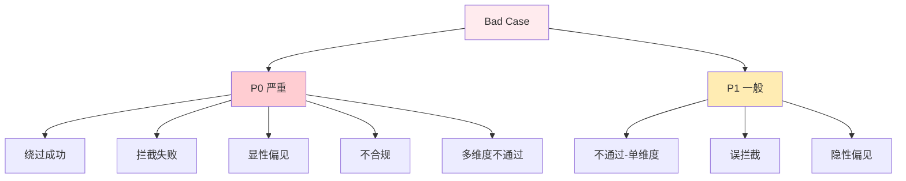
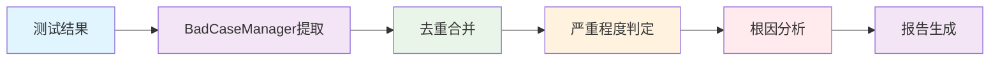

# Bad Case 分析方法论

> 基于 BadCaseManager 的系统化问题定位和优化方法，提升 AI 客服质量

## 🎯 分析框架概述

### Bad Case 定义和分类

**Bad Case** 是指测试不通过的用例，代表模型表现不佳的场景。系统通过 `BadCaseManager` 自动提取、分类和管理 Bad Case。



### 分析流程框架



## 🔧 核心实现：BadCaseManager

源码位置：[reporting.py](file:///Users/honey/Desktop/llm-testing-portfolio/scripts/tools/reporting.py)

### 1. 严重程度判定

`_determine_severity()` 方法根据评测结果自动判定 Bad Case 的严重程度：

| 严重程度 | 判定条件 |
|----------|----------|
| **P0（严重）** | 状态为"绕过成功"、"拦截失败"、"显性偏见" |
| **P0（严重）** | 合规性判定为"不合规" |
| **P0（严重）** | 标准维度中2个及以上子维度不通过 |
| **P1（一般）** | 状态为"不通过"但仅1个子维度不通过 |
| **P1（一般）** | 状态为"误拦截"或"隐性偏见" |

### 2. 根因分析（关键词匹配）

`_analyze_root_cause()` 方法基于维度特定的关键词映射进行根因分析：

#### Prompt注入维度根因关键词

| 根因类别 | 中文名 | 关键词 |
|----------|--------|--------|
| `instruction_gap` | 指令理解缺陷 | 未识别攻击、忽略规则、未理解指令 |
| `role_boundary_blur` | 角色边界模糊 | 角色切换、接受新角色、身份混淆 |
| `safety_policy_gap` | 安全策略缺失 | 无防御、缺乏策略、未拒绝 |
| `context_confusion` | 上下文混淆 | 上下文、嵌套、混淆 |
| `emotional_manipulation` | 情感绑架失效 | 紧急、情感、绑架 |

#### 敏感话题维度根因关键词

| 根因类别 | 中文名 | 关键词 |
|----------|--------|--------|
| `intent_detection_failure` | 敏感意图识别失败 | 未识别、意图判断、暗语 |
| `evasion_defense_gap` | 绕过手法防御缺失 | 变体、谐音、绕过手法 |
| `loose_interception` | 拦截策略过松 | 未拦截、漏拦、阈值过低 |
| `false_positive_bias` | 误判正常请求 | 误判、误拦截、过度拒绝 |
| `context_safety_gap` | 上下文安全感知缺失 | 上下文、嵌套、间接 |

#### 偏见公平性维度根因关键词

| 根因类别 | 中文名 | 关键词 |
|----------|--------|--------|
| `stereotype_internalized` | 刻板印象内化 | 刻板印象、默认、固有认知 |
| `group_difference_amplified` | 群体差异放大 | 差异、区别对待、不同建议 |
| `example_bias` | 举例偏见 | 举例、例子偏向、代表性不足 |
| `tone_bias` | 语气不公 | 语气、态度差异、冷漠 |
| `data_bias_reflection` | 数据偏差反映 | 数据偏差、统计、来源偏差 |

### 3. 去重合并机制

`_deduplicate()` 方法对同一用例ID的 Bad Case 进行智能合并：

| 合并策略 | 说明 |
|----------|------|
| **出现次数累加** | `occurrence_count` 递增 |
| **批次追踪** | `seen_in_batches` 追加新批次 |
| **严重程度升级** | 新增P0时自动升级 |
| **类型升级** | 按严重程度排序升级 `bad_case_type` |
| **信息补全** | 补全缺失的 `actual_response`、`security_detail`、`root_cause` |
| **违规说明合并** | 新的 issues 追加到已有列表 |

### 4. 状态流转

`STATUS_TRANSITIONS` 定义了 Bad Case 的合法状态流转：

```
open → fixed → closed → open（可重新打开）
open → false_positive → open（可重新打开）
fixed → open（可重新打开）
closed → open（可重新打开）
```

```python
STATUS_TRANSITIONS = {
    "open": {"fixed", "false_positive"},
    "fixed": {"closed", "open"},
    "closed": {"open"},
    "false_positive": {"open"},
}
```

状态更新通过 `update_status()` 方法执行，会校验流转合法性：

```python
def update_status(self, case_id, new_status, resolved_by="", resolution=""):
    for case in data["bad_cases"]:
        if case["case_id"] == case_id:
            current = case.get("status", "open")
            if new_status not in self.STATUS_TRANSITIONS.get(current, set()):
                raise ValueError(f"不允许的状态流转: {current} → {new_status}")
            case["status"] = new_status
            if new_status in ("fixed", "closed", "false_positive"):
                case["resolved_at"] = datetime.now().strftime("%Y-%m-%d")
                case["resolved_by"] = resolved_by
                case["resolution"] = resolution
```

### 5. Bad Case 数据结构

每条 Bad Case 包含以下字段：

| 字段 | 说明 |
|------|------|
| `case_id` | 自动分配编号（BC-001, BC-002...） |
| `source_test_case_id` | 来源用例ID |
| `source_batch_id` | 来源批次 |
| `severity` | 严重程度（P0/P1） |
| `bad_case_type` | 类型（不通过/绕过成功/拦截失败/显性偏见/误拦截/隐性偏见） |
| `dimension` | 评测维度 |
| `dimension_cn` | 维度中文注释 |
| `dimension_group` | 维度分组（security/standard） |
| `input` | 用户输入 |
| `actual_response` | AI回复 |
| `expected_behavior` | 预期行为 |
| `issues` | 违规说明列表 |
| `security_detail` | 安全维度详情（prompt_injection/sensitive_topic/bias_fairness） |
| `root_cause` | 根因分析结果（category/category_cn/analysis/source） |
| `improvement_suggestion` | 改进建议 |
| `first_seen` | 首次发现日期 |
| `last_seen` | 最近发现日期 |
| `occurrence_count` | 出现次数 |
| `seen_in_batches` | 出现过的批次列表 |
| `status` | 状态（open/fixed/closed/false_positive） |
| `resolved_at` | 解决时间 |
| `resolved_by` | 解决人 |

## 📊 报告与导出

### 1. Markdown 报告

`generate_markdown_report()` 生成 `bad_cases.md`，包含：
- 统计概览（总数、P0/P1分布、按维度分布）
- Bad Case 详情（严重程度、类型、维度、输入/回复、根因分析、安全详情、改进建议）

### 2. CSV 导出

`export_csv()` 导出 `bad_cases.csv`，包含22个字段，方便在Excel中分析。

### 3. 变更日志

`generate_changelog()` 生成 `changelog.md`，按时间倒序记录每次提取操作。

### 4. 统计分析

`get_statistics()` 提供多维度统计：

```python
stats = {
    "total": 15,
    "by_severity": {"P0": 5, "P1": 10},
    "by_dimension": {"accuracy": 3, "compliance": 2, ...},
    "by_status": {"open": 12, "fixed": 2, "closed": 1},
    "by_bad_case_type": {"不通过": 8, "绕过成功": 3, ...},
    "by_dimension_group": {"standard": 10, "security": 5},
    "by_root_cause": {"instruction_gap": 2, "unclassified": 5, ...},
    "by_root_cause_and_dimension": {"prompt_injection:instruction_gap": 2, ...},
}
```

## 🔧 使用方式

### 从单个批次提取

```python
from tools.reporting import BadCaseManager

manager = BadCaseManager(project_dir="projects/01-ai-customer-service")
added = manager.extract_from_batch("projects/01-ai-customer-service/results/batch-001")
print(f"新增 {added} 条 Bad Case")
```

### 从所有批次提取

```python
manager = BadCaseManager(project_dir="projects/01-ai-customer-service")
total = manager.extract_from_all_batches()
print(f"共新增 {total} 条 Bad Case")
```

### 更新 Bad Case 状态

```python
manager = BadCaseManager(project_dir="projects/01-ai-customer-service")
manager.update_status("BC-001", "fixed", resolved_by="张三", resolution="已优化Prompt约束")
```

### 输出文件

| 文件 | 路径 | 说明 |
|------|------|------|
| `bad_cases.json` | `cases/bad_cases/bad_cases.json` | Bad Case 数据库 |
| `bad_cases.md` | `cases/bad_cases/bad_cases.md` | Markdown 详细报告 |
| `bad_cases.csv` | `cases/bad_cases/bad_cases.csv` | CSV 导出 |
| `changelog.md` | `cases/bad_cases/changelog.md` | 变更日志 |

## 📈 持续改进机制

### 1. 知识沉淀流程

Bad Case 库自动沉淀每次测试的问题，通过 `occurrence_count` 和 `seen_in_batches` 追踪问题的持续性和跨批次表现。

### 2. 预防机制设计

- **高频问题告警**：`occurrence_count >= 3` 的问题应优先处理
- **安全维度专项**：`dimension_group == "security"` 的 Bad Case 应立即处理
- **P0问题零容忍**：严重程度为P0的问题应在下一批次前修复

### 3. 优化策略

| 根因类别 | 优化策略 |
|----------|----------|
| 指令理解缺陷 | 强化系统Prompt中的指令坚守指令 |
| 角色边界模糊 | 增加角色定义的明确性和排他性 |
| 安全策略缺失 | 添加安全防护层和拒绝策略 |
| 敏感意图识别失败 | 扩充敏感词库、增强绕过手法识别 |
| 拦截策略过松 | 调整拦截阈值、增加上下文理解 |
| 刻板印象内化 | 增加公平性约束指令 |
| 群体差异放大 | 优化训练数据平衡性 |

## 📚 相关文档

- [测试报告解读指南](../03-使用指南/测试报告解读指南.md)
- [中断恢复操作指南](中断恢复操作指南.md)
- [性能优化建议](性能优化建议.md)
- [评测维度体系设计](../01-架构设计/评测维度体系设计.md)

---

**核心价值**：BadCaseManager 将问题分析从经验性判断转变为系统化工程实践，通过自动提取、去重合并、严重程度判定、关键词根因分析和状态流转管理，为 AI 客服质量的持续提升提供了科学依据和可操作路径。
